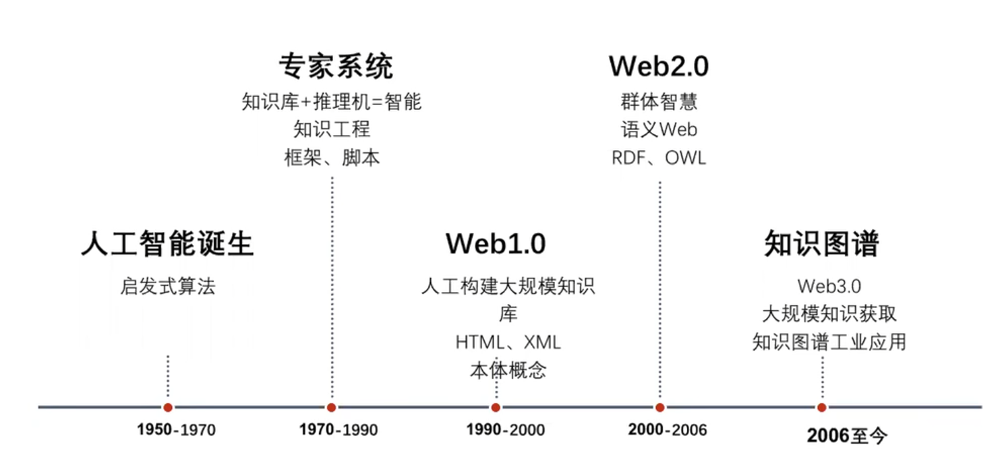

# 大数据技术路线

[TOC]

## 大数据平台

**智能化地学大数据平台的构建**

- 地学大数据平台数据处理
- 数据存储
- 数据共享

## 数据挖掘

## 1. 人工智能

- 人工智能、机器学习、深度学习

### 1.1 机器学习

- 半监督分类
- 贝叶斯

#### 1.1.1 深度学习

- 识别地形
- YOLO V5断层识别

### 1.2 知识图谱

- RDF
- RDFs
- 本体语言OWL

- 知识图谱可视化工具
  - [CiteSpace](http://cluster.cis.drexel.edu/~cchen/citespace/)
  - protege
  - Neo4J
    - 结合前端技术进行可视化：https://zhuanlan.zhihu.com/p/126219777
    - 全新的Neo4j Bloom可视化工具
  - 自然语言处理 NLP
    - 文本提取
  - 推荐系统
- 知识抽取
  - Yago
  - DBPedia
  - Freebase
- 知识融合
  - 属性相似度
  - 实体相似库
- 基于云计算平台的系统（适合做数据分析）
  - Hadoop
  - Spark
- 基于数据划分的系统（适合知识问答）
- 联邦式系统

## 2. 数据共享

### 2.1 区块链

- 区块链技术的实施能够有效保障数据的隐私性, 利于数据流通与数据共享。

## 空间索引

- Hadoop + Spark + Kafka + Zookeeper
- TensorFlow
-  ElasticSearch：可以实现列索引，提供快速列查找。
- 区块链技术-->地学数据共享
  - 数据分享过程中的安全、质量、效率问题

- 以把深度学习与Spark相整合
- 雅虎已实现了TensorFlow与Spark的整合

- 

