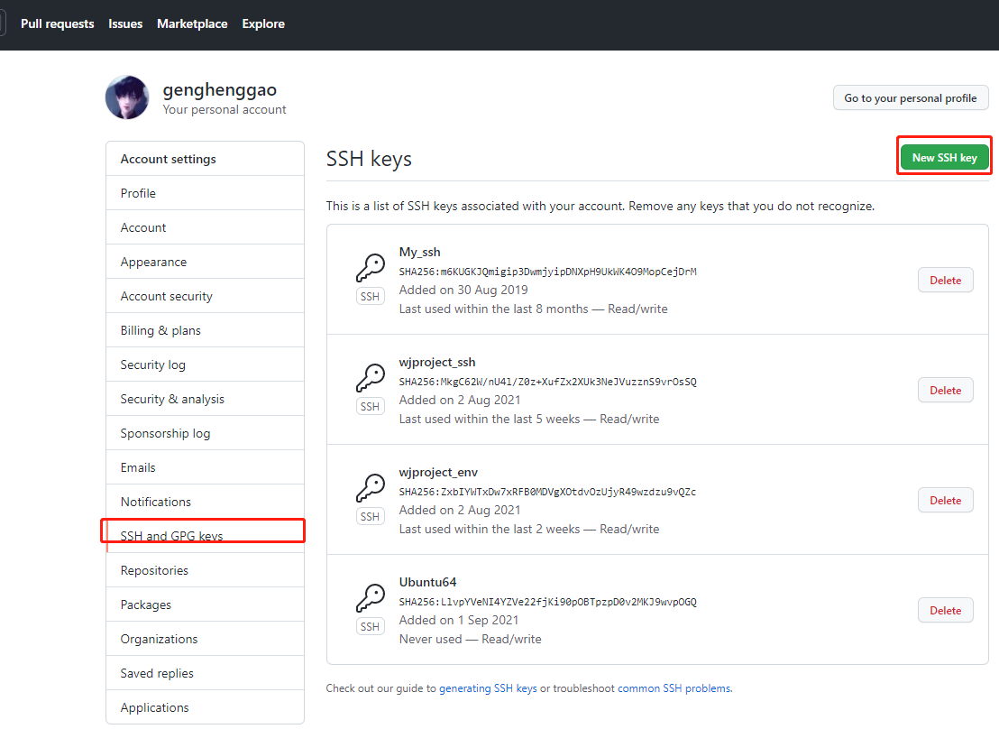

# 分支


```bash
# 在本地新建一个分支： 
git branch Branch1
# 切换到你的新分支: 
git checkout Branch1
# 上面两句可以简化为：
git checkout -b Branch1

# 将新分支发布在github上： 
git push origin Branch1

# 在本地删除一个分支： 
git branch -d Branch1

#在github远程端删除一个分支(分支名前的冒号代表删除)： 
git push origin :Branch1   

# 查看本地所有分支 
git branch 
# 查看远程所有分支
git branch -r 
# 查看本地和远程的所有分支
git branch -a 
# 重命名本地分支
git branch -m <oldbranch> <newbranch> //重命名本地分支

-d
--delete：删除

-D
--delete --force的快捷键

-f
--force：强制

-m
--move：移动或重命名

-M
--move --force的快捷键

-r
--remote：远程

-a
--all：所有
```


## git fetch 用法

```bash
# 将某个远程主机的更新全部取回本地
git fetch <远程主机名> 
# 只取回特定分支的更新，可以指定分支名，注意之间有空格
git fetch <远程主机名> <分支名> 
# 最常见的命令如取回origin 主机的master 分支
git fetch origin master

#取回更新后，会返回一个FETCH_HEAD ，指的是某个branch在服务器上的最新状态，我们可以在本地通过它查看刚取回的更新信息：
git log -p FETCH_HEAD
```


## git pull 用法

- `git pull` 的过程可以理解为：

```bash
# 从远程主机的master分支拉取最新内容 
git fetch origin master 
#  将拉取下来的最新内容合并到当前所在的分支中
git merge FETCH_HEAD  
```


```bash
# 将远程主机的某个分支的更新取回，并与本地指定的分支合并，完整格式可表示为：
git pull <远程主机名> <远程分支名>:<本地分支名>
# 如果远程分支是与当前分支合并，则冒号后面的部分可以省略：
git pull origin next
```


## 另一台计算机同步github

- 两台电脑都配置密钥，settings设置

  

- 一台成功提交任务，另一台

  ```bash
  git clone XXXX
  ```

  

- 提交新的代码

  ```bash
  # 在本地新建一个分支： 
  git branch Branch1
  # 切换到你的新分支: 
  git checkout Branch1
  # 上面两句可以简化为：
  git checkout -b Branch1
  
  # 将新分支发布在github上： 
  git push origin Branch1
  
  # 切换到master，合并Branch1分支
  git checkout master
  git merge Branch1
  ```

  

- 同步代码

  ```bash
  # 从远程主机的master分支拉取最新内容 
  git fetch origin master 
  #  将拉取下来的最新内容合并到当前所在的分支中
  git merge FETCH_HEAD  
  ```

  
