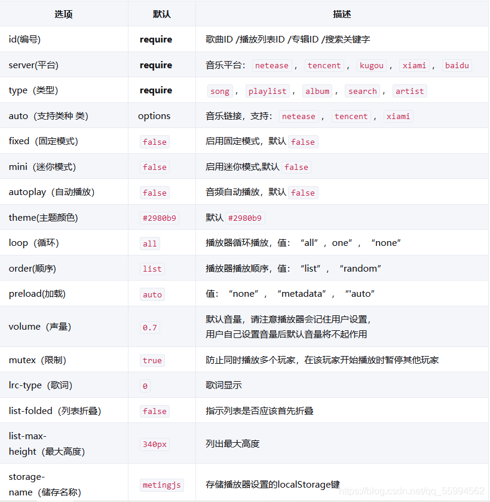

# 🎶 音乐播放器


### **在这里我们使用的是Metingjs，基于Aplayer插件封装好的插件，可以直接使用**

第一步：

在`<head>`标签下面引入两个`script`和一个`css`样式

```
<link rel="stylesheet" href="https://cdn.jsdelivr.net/npm/aplayer/dist/APlayer.min.css">
 
<script src="https://cdn.jsdelivr.net/npm/aplayer/dist/APlayer.min.js"></script>
 
<script src="https://cdn.jsdelivr.net/npm/meting@2/dist/Meting.min.js"></script>
```


第二步：在<body>中定义播放器的属性，可以参考下表更改参数

```
<meting-js
        server="netease"    <%--平台--%>
        type="playlist"        <%--类型--%>
        id="2811637909"         <%--播放列表ID--%>
        fixed="true"        <%--固定模式--%>
        autoplay="true"   <%--自动播放--%>
        loop="all"          <%--循环--%>
        order="list"      <%--顺序--%>
        preload="auto"      <%--加载--%>
        list-folded="ture"      <%--列表折叠--%>
        list-max-height="1000px"    <%--最大高度--%>
        lrc-type="1">       <%--歌词--%>
</meting-js>
```


- 参数说明

  


- [ref](https://blog.csdn.net/qq_55994562/article/details/116585035)

