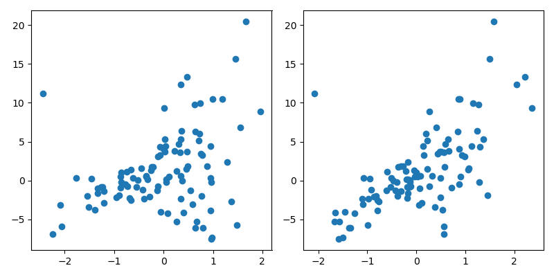

# 统计建模


## 模块

- statsmodels
- Patsy


## 示例一

```python
import statsmodels.api as sm
import statsmodels.formula.api as smf
import statsmodels.graphics.api as smg

import patsy
import numpy as np
import pandas as pd

from scipy import stats

np.random.seed(123456789)
y = np.array([1, 2, 3, 4, 5])
x1 = np.array([6, 7, 8, 9, 10])
x2 = np.array([11, 12, 13, 14, 15])
X = np.vstack([np.ones(5), x1, x2, x1*x2]).T
print(X)
```


## 示例二

```python
N = 100
x1 = np.random.randn(N)
x2 = np.random.randn(N)
data = pd.DataFrame({"x1": x1, "x2": x2})
def y_true(x1, x2):
    return 1  + 2 * x1 + 3 * x2 + 4 * x1 * x2
data["y_true"] = y_true(x1, x2)
e = np.random.randn(N)
data["y"] = data["y_true"] + e
print(data.head())
```

- 输出

  ```
           x1        x2    y_true         y
  0  0.274906  1.480807  7.620563  8.947318
  1 -2.783097 -0.265374 -2.408066 -2.600460
  2 -0.373264 -1.072807 -1.363188 -1.300481
  3 -0.276616 -0.632052 -0.750046 -1.343132
  4  1.073187 -1.628440 -8.729431 -8.982336
  ```


```python
N = 100
x1 = np.random.randn(N)
x2 = np.random.randn(N)
data = pd.DataFrame({"x1": x1, "x2": x2})
def y_true(x1, x2):
    return 1  + 2 * x1 + 3 * x2 + 4 * x1 * x2
data["y_true"] = y_true(x1, x2)
e = np.random.randn(N)
data["y"] = data["y_true"] + e
# print(data.head())

fig, axes = plt.subplots(1, 2, figsize=(8, 4))

axes[0].scatter(data["x1"], data["y"])
axes[1].scatter(data["x2"], data["y"])

fig.tight_layout()
plt.show()
```




