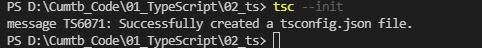
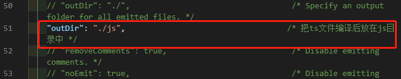
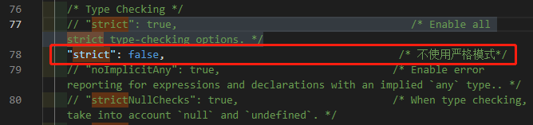

## vscode自动编译

```
1). 生成配置文件tsconfig.json
    tsc --init
2). 修改tsconfig.json配置
    "outDir": "./js",
    "strict": false,    
3). 启动监视任务: 
    终端 -> 运行任务 -> 显示所有任务 -->监视tsconfig.json
```










