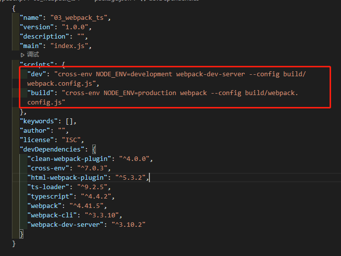

## 下载依赖

- 对应项目目录下

  ```sh
  # 生成tsconfig.json
  tsc --init
  ```

  

- 新建src/main.ts

  ```tsx
  document.write('Hello Webpack TS!')
  ```

- 新建public/index.html

  ```html
  <!DOCTYPE html>
  <html lang="en">
  <head>
    <meta charset="UTF-8">
    <meta name="viewport" content="width=device-width, initial-scale=1.0">
    <meta http-equiv="X-UA-Compatible" content="ie=edge">
    <title>webpack & TS</title>
  </head>
  <body>
    
  </body>
  </html>
  ```

  

- 新建bulid/webpack.config.js

  ```js
  const {CleanWebpackPlugin} = require('clean-webpack-plugin')
  const HtmlWebpackPlugin = require('html-webpack-plugin')
  const path = require('path')
  
  const isProd = process.env.NODE_ENV === 'production' // 是否生产环境
  
  function resolve (dir) {
    return path.resolve(__dirname, '..', dir)
  }
  
  module.exports = {
    mode: isProd ? 'production' : 'development',
    entry: {
      app: './src/main.ts'
    },
  
    output: {
      path: resolve('dist'),
      filename: '[name].[contenthash:8].js'
    },
  
    module: {
      rules: [
        {
          test: /\.tsx?$/,
          use: 'ts-loader',
          include: [resolve('src')]
        }
      ]
    },
  
    plugins: [
      new CleanWebpackPlugin({
      }),
  
      new HtmlWebpackPlugin({
        template: './public/index.html'
      })
    ],
  
    resolve: {
      extensions: ['.ts', '.tsx', '.js']
    },
  
    devtool: isProd ? 'cheap-module-source-map' : 'cheap-module-eval-source-map',
  
    devServer: {
      host: 'localhost', // 主机名
      stats: 'errors-only', // 打包日志输出输出错误信息
      port: 8081,
      open: true
    },
  }
  ```

  

```sh
# 生成package.json文件
npm init -y
```


- 注意版本问题

```sh
# 安装模块
npm install -D typescript

npm install -D webpack@4.41.5 webpack-cli@3.3.10 webpack-dev-server@3.10.2

npm install -D html-webpack-plugin@4.5.0 clean-webpack-plugin ts-loader@8.0.11 cross-env
```


- 配置打包命令

```text
"dev": "cross-env NODE_ENV=development webpack-dev-server --config build/webpack.config.js",
"build": "cross-env NODE_ENV=production webpack --config build/webpack.config.js"
```




- 运行打包

```
npm run dev
npn run bulid
```

