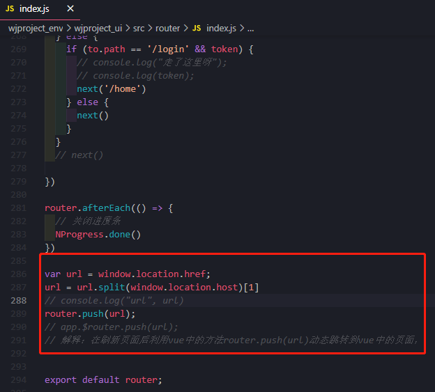

# 开发Tips

[TOC]


## 2. vue打包后刷新页面丢失问题

- Vue打包后部署，vue+Django+Niginx+uWSGI部署刷新页面，出现404

- router/index.js

```js
var url = window.location.href;
url = url.split(window.location.host)[1]
console.log("url", url)
router.push(url);
 
// 解释：在刷新页面后利用vue中的方法router.push(url)动态跳转到vue中的页面，
```




- Django根目录下wjproject_v1

- wjproject_v1/urls.py

```python
# django后端路由配置：
urlpatterns = [
    path('admin/', admin.site.urls),
    path('app/', include('app.urls')),
    url(r'^[a-zA-Z]*', views.index)  # 将访问的所有关于vue的路径都指向index页面
]
# 注意这里的顺序，最好把通用匹配放到最后
```

- wjproject_v1/views.py

```python
# 视图函数

from django.shortcuts import render
from django.views.decorators.csrf import csrf_exempt

@csrf_exempt
def index(request):
    return render(request, "index.html")
```


- [ref](https://blog.csdn.net/a1053904672/article/details/115610029)


## 3. Django使用Websocket

- [ref](https://www.cnblogs.com/xiao987334176/p/14361893.html)

#### 一、概述

在项目中，需要使用websocket，来展示一些实时信息。

这里使用django 3.1.5


#### 二、django项目

安装模块

```
pip3 install django-cors-headers channels
pip3 install channels
```

 

新建项目websocket_demo


 

修改websocket_demo/asgi.py

```
import os
from channels.auth import AuthMiddlewareStack
from django.core.asgi import get_asgi_application
# Import other Channels classes and consumers here.
from channels.routing import ProtocolTypeRouter, URLRouter
# from apps.websocket_app.urls import websocket_urlpatterns
from websocket_demo.urls import websocket_urlpatterns

os.environ.setdefault('DJANGO_SETTINGS_MODULE', 'websocket_demo.settings')

# application = get_asgi_application()
application = ProtocolTypeRouter({
    # Explicitly set 'http' key using Django's ASGI application.
    "http": get_asgi_application(),
    'websocket': AuthMiddlewareStack(
        URLRouter(
            websocket_urlpatterns
        )
    ),
})
```


修改websocket_demo/settings.py

注册corsheaders和channels，corsheaders主要是用来解决跨域问题的。

```
INSTALLED_APPS = [
    'django.contrib.admin',
    'django.contrib.auth',
    'django.contrib.contenttypes',
    'django.contrib.sessions',
    'django.contrib.messages',
    'django.contrib.staticfiles',
    'api.apps.ApiConfig',
    'corsheaders',  # 注册应用cors
    'channels'
]
```

 

注册中间件

```
MIDDLEWARE = [
    'django.middleware.security.SecurityMiddleware',
    'django.contrib.sessions.middleware.SessionMiddleware',
    'django.middleware.common.CommonMiddleware',
    'django.middleware.csrf.CsrfViewMiddleware',
    'django.contrib.auth.middleware.AuthenticationMiddleware',
    'django.contrib.messages.middleware.MessageMiddleware',
    'django.middleware.clickjacking.XFrameOptionsMiddleware',
    'corsheaders.middleware.CorsMiddleware',  # 注册组件cors
]
```

 

最后一行增加以下内容

```
# 跨域增加忽略
CORS_ALLOW_CREDENTIALS = True
CORS_ORIGIN_ALLOW_ALL = True

CORS_ALLOW_METHODS = (
    'GET',
    'OPTIONS',
    'PATCH',
    'POST',
    'VIEW',
)

CORS_ALLOW_HEADERS = (
    'XMLHttpRequest',
    'X_FILENAME',
    'accept-encoding',
    'authorization',
    'content-type',
    'dnt',
    'origin',
    'user-agent',
    'x-csrftoken',
    'x-requested-with',
    'Pragma',
)

# 指定ASGI的路由地址
ASGI_APPLICATION = 'websocket_demo.asgi.application'
```

注意：ASGI是用来做异步请求的。

websocket_demo.asgi.application 表示，websocket_demo/asgi.py里面的application

 

修改websocket_demo/urls.py

增加websocket路由

```
from django.contrib import admin
from django.urls import path
from api.views import ChatConsumer

urlpatterns = [
    path('admin/', admin.site.urls),
]

websocket_urlpatterns = [
    # 前端请求websocket连接
    path('wx/', ChatConsumer.as_asgi()),
]
```


修改api/views.py

```
from django.shortcuts import render

from channels.generic.websocket import WebsocketConsumer
import json
import time

# Create your views here.
class ChatConsumer(WebsocketConsumer):
    def connect(self):
        self.accept()

    def disconnect(self, close_code):
        pass

    def receive(self, text_data):
        """
        接收消息
        :param text_data: 客户端发送的消息
        :return:
        """
        print(text_data)
        poetryList = [
            "云想衣裳花想容",
            "春风拂槛露华浓",
            "若非群玉山头见",
            "会向瑶台月下逢",
        ]
        for i in poetryList:
            time.sleep(0.5)
            self.send(i)
```

说明：

这里主要介绍receive，它是用来接收/发送消息的。即可以接收客户端，也就是vue发送的消息。也可以发送消息给客户端。

 

最后启动django项目即可

 

#### 三、vue项目

新建一个vue项目，安装ElementUI 模块即可。

新建test.vue

```vue
<template>
  <div style="width: 70%;margin-left: 30px;margin-top: 30px;">
    <el-table
      :data="content"
      style="width: 100%;">
      <el-table-column
        prop="info"
        label="实时执行日志"
      >
      </el-table-column>
    </el-table>
    <br>
    <el-button type="primary" @click="onSubumit">提交</el-button>
  </div>
</template>

<script>
  export default {
    data() {
      return {
        content:[],
      }
    },
    mounted: function() {

    },
    methods: {
      onSubumit(){
        // 清空消息
        this.content = []
        // 执行webSocket
        this.webSocket()
      },
      webSocket() {
        const _this = this;
        if (typeof (WebSocket) == 'undefined') {
          this.$notify({
            title: '提示',
            message: '当前浏览器无法接收实时报警信息，请使用谷歌浏览器！',
            type: 'warning',
            duration: 0
          });
        } else {
          // 实例化socket
          const socketUrl = 'ws://127.0.0.1:8000/wx/';
          this.socket = new WebSocket(socketUrl);
          // 监听socket打开
          this.socket.onopen = function() {
            console.log('浏览器WebSocket已打开');
            //发送字符:
            _this.socket.send(JSON.stringify({
              'username': "xiao",
              'msg': "hello",
            }));
          };
          // 监听socket消息接收
          this.socket.onmessage = function(msg) {
            // 追加到内容显示列表中
            _this.content.push({"info":msg.data})
          };
          // 监听socket错误
          this.socket.onerror = function() {
            _this.$notify({
              title: '错误',
              message: '服务器错误，无法接收实时报警信息',
              type: 'error',
              duration: 0
            });
          };
          // 监听socket关闭
          this.socket.onclose = function() {
            console.log('WebSocket已关闭');
          }
        }
      },
    }
  }
</script>

<style>
</style>
```

 

访问测试页面


 

点击提交，效果如下：

 

 
