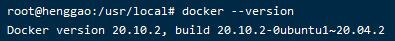
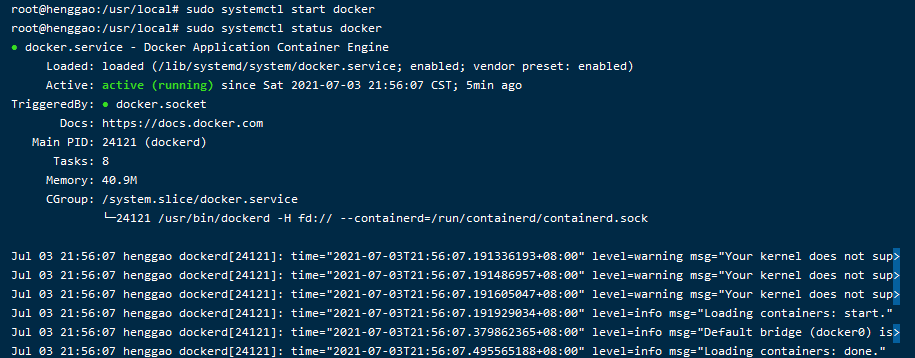

# 服务器设置

[TOC]

## 1、安装目录

```
cd /usr/local
```


## 2. 安装Docker

### 2.1 安装

Docker 的使用能极大地方便我们的开发，减少环境搭建，依赖安装等繁琐且容易出错的问题。

Ubuntu 20.04 官方 apt 源中就有 Docker，我们可以直接通过 apt 来安装

```
#更新ubuntu的apt源索引
sudo apt update

# 安装Docker
sudo apt install docker.io

# 查看版本
docker --version
```



### 2.2 启动

```
#启动命令
root@henggao:/usr/local# sudo systemctl start docker

#查看状态
root@henggao:/usr/local# sudo systemctl status docker
```




### 2.3 关闭

```
sudo systemctl stop docker
```


**Tips✨**

- 每次停止`docker systemctl stop docker` 命令执行完都会提示

```
Warning: Stopping docker.service, but it can still be activated by: docker.socket
```

**解释**

- 这是因为除了docker.service单元文件，还有一个docker.socket单元文件…docker.socket这是用于套接字激活。
  该警告意味着：如果你试图连接到docker socket，而docker服务没有运行，系统将自动启动docker。

**解决方案**

```
#如果不想被访问时自动启动服务
sudo systemctl stop docker.socket
```

