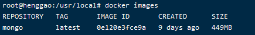
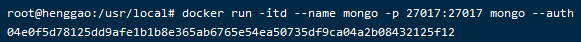
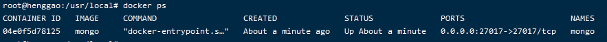
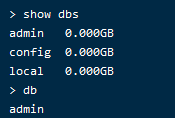
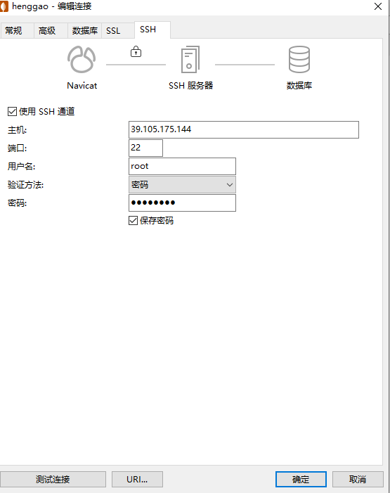
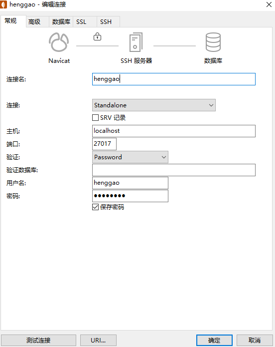

# Docker中MongoDB

[TOC]

## 1. Docker安装MongoDB

### 1、命令来查看可用版本：

```shell
docker search mongo
```


### 2、取最新版的 MongoDB 镜像

```shell
docker pull mongo:latest
```


### 3、查看本地镜像

使用以下命令来查看是否已安装了 mongodb：

```shell
$ docker images
```



在上图中可以看到我们已经安装了最新版本（latest）的 mongo 镜像。

### 4、运行容器

安装完成后，我们可以使用以下命令来运行 mongo 容器：

```shell
$ docker run -itd --name mongo -p 27017:27017 mongo --auth
```

参数说明：

- **-p 27017:27017** ：映射容器服务的 27017 端口到宿主机的 27017 端口。外部可以直接通过 宿主机 ip:27017 访问到 mongo 的服务。

- **--auth**：需要密码才能访问容器服务。

  


### 5、安装成功

最后我们可以通过 **docker ps** 命令查看容器的运行信息

```
docker ps
```




接着使用以下命令添加用户和设置密码，并且尝试连接。

```shell
$ docker exec -it mongo mongo admin
# 创建一个名为 admin，密码为 123456 的用户。
>  db.createUser({ user:'admin',pwd:'123456',roles:[ { role:'userAdminAnyDatabase', db: 'admin'},"readWriteAnyDatabase"]});
# 尝试使用上面创建的用户信息进行连接。
> db.auth('admin', '123456')
```

- 用户名：henggao

  ```
  show dbs
  ```

  


- [ref](https://www.runoob.com/docker/docker-install-mongodb.html)


## 2. 用户权限

- [ref](https://www.cnblogs.com/banbosuiyue/p/13094105.html)


## 3. Navicat连接Docker中的MongoDB

### 3.1 使用SSH连接方式，连接服务器


- 主机名：阿里云IP
- 端口号：默认是22
- 用户名：你的服务器用户
- 密码：服务器密码

### 3.2连接数据库



- 连接名：自己随便起
- 主机名：localhost
- 用户名：Docker中MongoDB设置的用户名
- 密码：Docker中MongoDB设置的用户密码


## 4. 数据备份

- [ref](https://www.huaweicloud.com/articles/8c36d50a4643d77b4f0abb27555b8aa7.html)