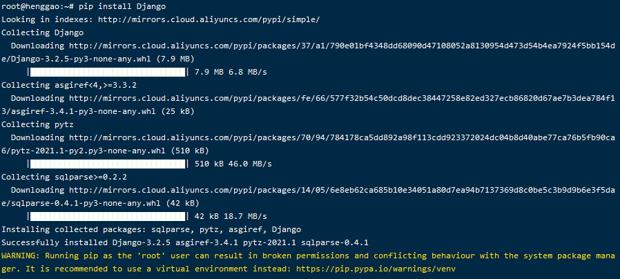
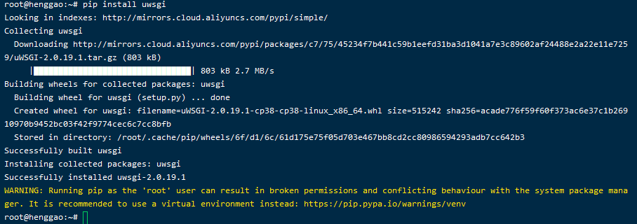
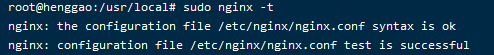

# 安装

[TOC]


## 1.安装Django

- **通过 pip 命令：**

```shell
pip install Django
```



- Django-3.2.5


## 2. 安装uWSGI

- **通过 pip 命令：**

```
pip install uwsgi
```



- uwsgi-2.0.19.1


## 3. 安装Nginx

```shell
# 更新包
sudo apt-get update
# 下载安装nginx
sudo apt-get install nginx
```

- 测试安装，在命令行中输入：

```
sudo nginx -t
```



- 常见nginx操作命令

  ```shell
  service nginx stop //停止运行
  service nginx start  //启动nginx
  service nginx reload  // 重新加载nginx。配置文件完，常执行此步骤。
  service nginx restart   //重新开始
  ```

  