# 项目

[TOC]

## 1. 创建项目文件夹

- 在目录`/usr/local`下创建

```
mkdir wjproject_docker
```

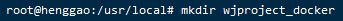

## 2. 创建Docker compose

- 在`wjproject_docker`目录下创建`compose`

  ```
  mkdir compose
  ```

  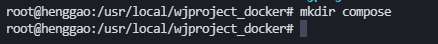


## 3. 创建`Django`项目

### 3.1 Django项目虚拟环境

- 安装虚拟环境

  ```
  pip install virtualenv
  pip install virtualenvwrapper
  ```


- 进入`wjproject_docker`目录，创建Django虚拟环境

  ```
   virtualenv wjproject_env
  ```

- 切换到虚拟环境目录，激活虚拟环境

  ```shell
  # 切换到虚拟环境目录
  cd wjproject_env
  
  # 激活虚拟环境
  source bin/activate
  ```

  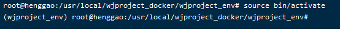

- 在虚拟环境中安装Django

  ```shell
  pip install django
  
  # 可以指定Django版本安装
  pip install django==2.2
  ```

  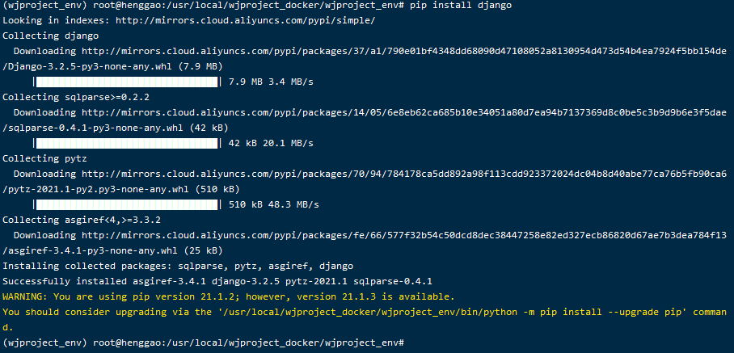

- 检查 Django 版本：

  ```
  django-admin --version
  ```

  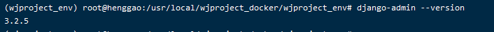

- 若想切换为正常的用户环境，可以使用以下的命令：

  ```
  deactivate
  ```


### 3.2 Django项目

- 在虚拟环境下`wjproject目录下创建`Django项目，注意添加最后`.`

  ```shell
   # 补充,最好加个点，不然会多创建一层目录
  django-admin startproject wjproject .
  ```

  ```txt
  项目目录说明：
  
  __init__.py: 说明test1是一个python包。
  
  settings.py: 项目的配置文件。
  
  urls.py: 进行url路由的配置。
  
  wsgi.py:  web服务器和Django交互的入口。
  
  manage.py:  项目的管理文件。
  ```

- 运行

  ```
  python manage.py runserver
  ```

  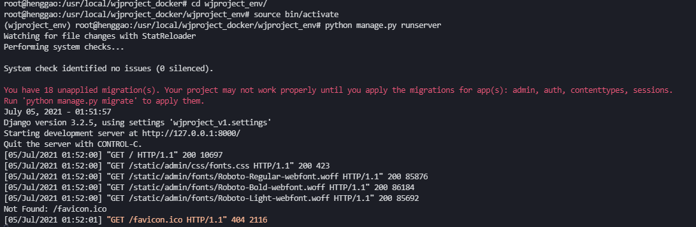

- 浏览器访问

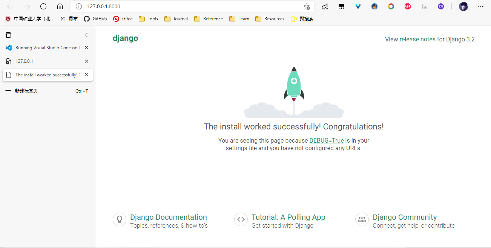

- `ctrl+c`结束
- 命令deactivate退出虚拟环境


### 3.3 创建应用APP

```
python manage.py startapp wjproject_app
```

​	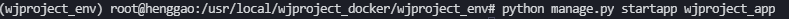

- 运行

  ```shell
  #迁移数据
  python3 manage.py migrate
  
  #运行项目
  python3 manage.py runserver
  ```

- 浏览器访问端口


- 创建App

  ```shell
   python3 manage.py startapp wjproject_app01
  ```


- 项目结构图

  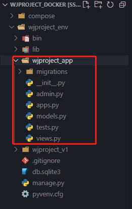

- [ref](https://xie.infoq.cn/article/9cf95edc8810abe6a61625c0c)


## 4. 创建Vue项目

### 4.1 环境安装

- 安装`Nodejs`

  ```
  # 安装
  sudo apt install nodejs
  
  # 查看nodejs版本
  nodejs -v
  ```

  - v10.19.0

    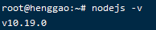

- 安装`npm`

  ```
  # 安装
  sudo apt install npm
  
  # 查看版本
  npm -v
  ```

  - 6.14.4

  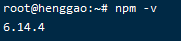

- 安装淘宝`NPM`镜像`cnpm`,为安装扩展提升速度

  ```
  #安装
  sudo npm install -g cnpm --registry=https://registry.npm.taobao.org
  
  #查看是否安装成功,成功会有版本号输出
  cnpm -v  
  ```

  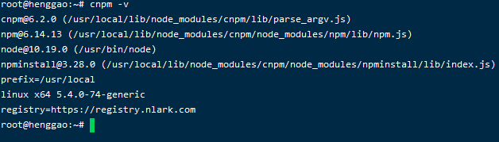

- 安装`vue`脚手架工具`vue-cli`

  - 安装`Vue2.0`

    ```
    # 安装，这种安装目前只能安装vue版本2.9.6
    sudo cnpm install -g vue-cli
    
    # 卸载
    npm uninstall vue-cli -g
    
    #查看版本号
    vue -V
    ```

    

  - 安装`vue3.0`

    ```
    安装
    npm install @vue/cli -g
    
    #查看版本号
    vue -V
    ```

    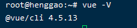

- Tips:✨建议还是使用`npm`安装，`cnpm`可能会有意外~

- 

### 4.2 Vue项目构建

- 创建Vue3.0项目

```
vue create wjproject_ui
```


- 切换到`wjproject_ui`目录，运行Vue项目

  ```
  npm run serve
  ```

  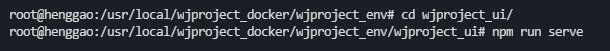

- 浏览器查看

  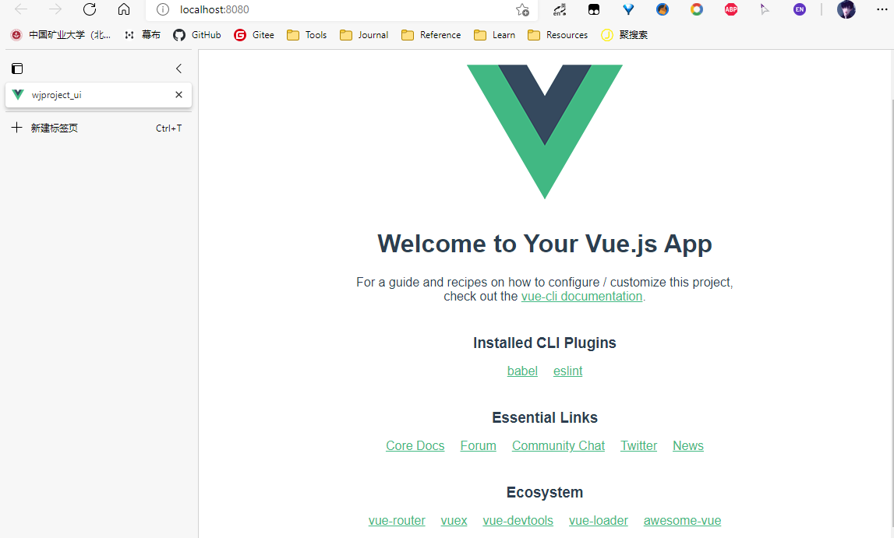


## 5. 安装`MongoDB`

- 安装

  ```shell
  # 目前安装mongodb3.6.8，安装版最新需要配置，稍微复杂点
  sudo apt install mongodb -y
  ```

- 输入`mongo`即可进入数据库

  ```shell
  # 启动 mongodb 服务
  service mongodb start
  
  # 关闭 mongodb 服务
  service mongodb stop
  
  # 重启 mongodb 服务
  service mongodb restart
  ```

  


## 6. 打包部署测试

- **Tips**🎈：写在前面，ECS服务器有安全规则，需要开放，见6.3

### 6.1 后端项目

#### 1. 后端项目`uWSGI`配置

- `uWSGI`配置，在Django根目录`/wjproject_docker/wjproject_env`下新建`wjproject_uwsgi.ini`文件，输入配置信息

  ```ini
  [uwsgi]
  ; 监听的端口,不配置nginx
  ; http = :8001
  #配置端口号,指定和nginx进行套接字通信的方式：端口或文件
  socket= 127.0.0.1:8000
  ; socket= 39.105.175.144:8000
  ; socket= 0.0.0.0:8002
  #项目的绝对路径,项目所在目录，和manage.py同级
  chdir=/usr/local/wjproject_docker/wjproject_env
  
  ; 主应用中的wsgi文件
  wsgi-file = wjproject_v1/wsgi.py
  
  ; 启动一个master进程，来管理其余的子进程
  master=true
  #设置最大工作进程数
  processes=4
  threads = 2
  
  #保存主进程的pid，用来控制uwsgi服务
  pidfile=/usr/local/wjproject_docker/wjproject_env/logs/uwsgi.pid
  
  ; 设置后台运行，保存日志
  daemonize=/usr/local/wjproject_docker/wjproject_env/logs/uwsgi.log
  
  ; 设置每个工作进程处理请求的上限，达到上限时，将回收（重启）该进程。可以预防内存泄漏
  max-requests=5000
  
  #服务停止时自动移除unix Socket和pid文件
  vacuum=true
  
  # 指定依赖的虚拟环境
  ; virtualenv=/home/peter/.virtualenvs/opwfenv
  virtualenv=/usr/local/wjproject_docker/wjproject_env
  ```
  
  - 注意：为了配合 `nginx` 工作，端口协议是 socket , 如果换成 `http` ,则可以直接运行`uwsgi`，就能通过浏览器访问页面了。命令为 `uwsgi dj_uwsgi.ini`。


#### 2.`Django`项目部署在阿里云准备

- `settings.py`设置

  - 第一处：`DEBUG = True`需要改为`DEBUG = False`

  ```python
  DEBUG = False
  
  ALLOWED_HOSTS = ['服务器公网IP']
  
  ```

  - 第二处

  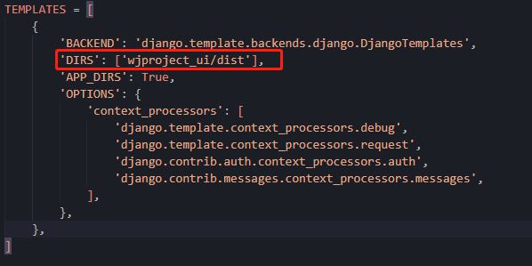

  - 第三处：

  ```python
  # Add for vuejs
  STATICFILES_DIRS = [  # 添加静态文件路径
      os.path.join(BASE_DIR, "wjproject_ui/static"),
  ]
  # 设置收集静态资源的路径(部署时使用)
  STATIC_ROOT = BASE_DIR
  ```

  

- `urls.py`设置

  ```python
  from django.views.generic import TemplateView
  
  urlpatterns = [
      path('admin/', admin.site.urls),
      path('',TemplateView.as_view(template_name="index.html")),
  ]
  
  ```

  

### 6.2 前端项目

- 前端项目打包

  - 进入前端项目目录，切换到`wjproject_ui`目录，运行打包

  ```
  npm run build
  ```

  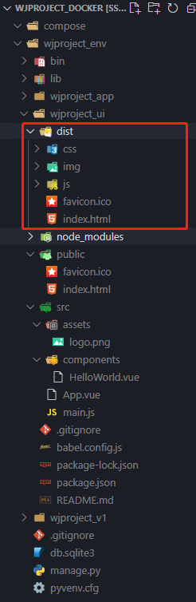

- `Nginx`部署，在006中已经安装好

- 配置`Nginx`的配置文件，目的是将`nginx`和`uWSGI`服务器实现通信连接。在`/etc/nginx/conf.d`文件夹下，创建`wjproject.conf`，内容如下：

  ```conf
  server {
     listen   8001;      
     server_name  39.105.175.144;
     charset     utf-8;
     client_max_body_size  75M;
     
     location /media {        
         expires 30d;
         autoindex  on;
         add_header Cache-Control private;
         alias /usr/local/wjproject_docker/wjproject_env/media/;
      }
      location /static {      
          expires 30d;
          autoindex on;
          add_header Cache-Control private;
          alias /usr/local/wjproject_docker/wjproject_env/wjproject_ui/dist/static;
       }
       location / {          
           include  uwsgi_params;
           uwsgi_pass 127.0.0.1:8000;
           uwsgi_read_timeout 2;
        }
  }
  
  server {
  	 listen 8004; 
  	 server_name 39.105.175.144; 
  	 location / {
  	 root /usr/local/wjproject_docker/wjproject_env/wjproject_ui/dist; 
  	 try_files $uri $uri/ /index.html; 
  	 }
   }
  ```
  
- 第一个server配置信息是将`nginx`和`uWSGI`服务器实现通信连接；
  
  - ```
      uwsgi_pass 127.0.0.1:8002; //必须和uwsgi中socket的设置一致
      ```
  
- 第二个server是配置Vue项目
  
- 完成上述文件配置后，重启`nginx`文件，命令如下：

  ```
  service nginx reload
  ```

  

- 运行`wjproject_uwsgi.ini`文件，在项目目录`/wjproject_env`下，使用如下命令启动`wjproject_uwsgi.ini`文件：

  ```bash
  #启动
  uwsgi --ini wjproject_uwsgi.ini
  # 停止
  uwsgi --stop logs/uwsgi.pid
  pkill -f uwsgi -9
  ```

- 查看进程

  ```
  ps -ef |grep uwsgi
  ```

  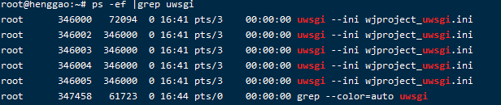

- 打开本地浏览器，访问成功。

```bash
http://39.105.175.144:8004
```

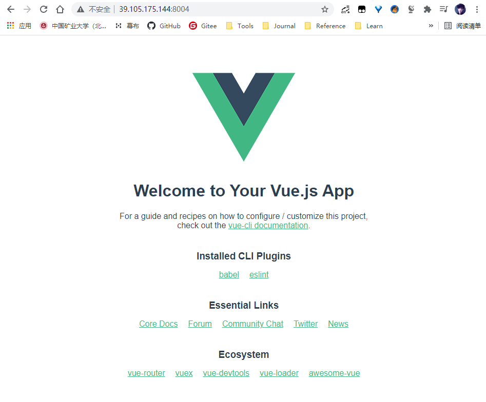

- **Tips：**在LINUX下部署`Nginx`、`uwsgi`、`django`时，出现问题`uwsgi`启动太多次：

```
sudo fuser -k 8080/tcp
```

- [ref](https://blog.csdn.net/weixin_44623662/article/details/109607897)

- [ref2](https://www.cnblogs.com/joy99/p/9034253.html)

- [ref3](https://www.cnblogs.com/wurijie/p/12950322.html)

  

### 6.3 阿里云部署

- ECS服务器上搭建的django项目通过公网ip和端口号访问，需要添加开发规则。

- 云服务器ECS下的【实例】,单击【更多】按钮，选择【 网络和安全组】-->【安全组配置】

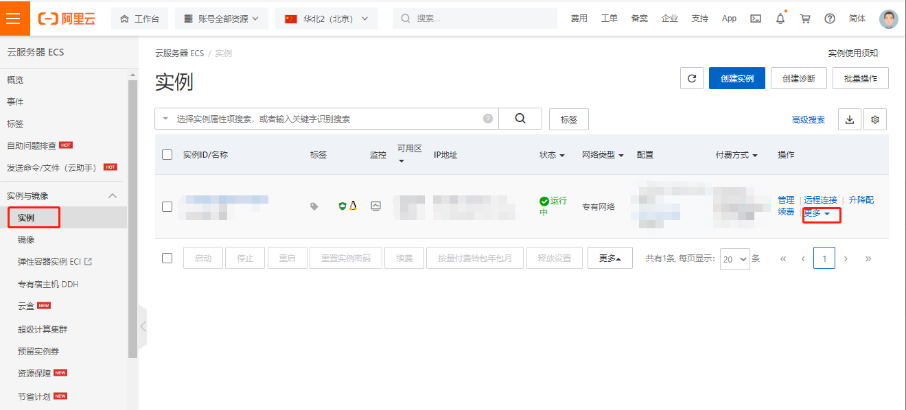

- 单击【配置规则】-->【手动添加】

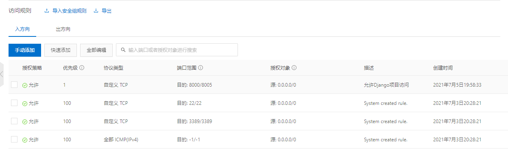


- [ref](https://www.jianshu.com/p/d6c64c892424)


## Django后端项目配置开机自启动

