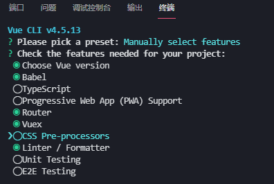
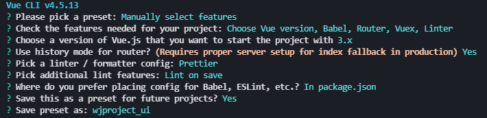
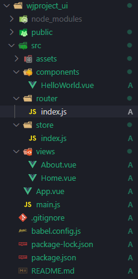

# Vue项目

[TOC]

## 0.Vue项目模块

### 常见模块

- vue-router
- vuex
- axios
- element-ui
- bootstrap
- vue-videobg
- less-loader
- nprogress 进度条
- @vue/composition-api （vue-cli4自带创建vue3项目已经自带了）
- wangeditor  富文本编辑器
- XLSX  Excel数据
- plupload  文件切片上传
- vue-simple-uploade
- v-viewer 图片查看
- vue-pdf PDF预览（目前只支持到vue2.0，vue3.0尝试失败，2021.7.29）
- pdfjs-dist  PDF预览
- vue3-print-nb 数据打印
- print-js

```bash
# 视频背景组件
npm install --save vue-videobg

#进度条
npm install --save nprogress

# @vue/composition-api
npm install @vue/composition-api --save

# 安装webpack，由于其他模块需要版本问题，需要重新安装
npm install --save-dev webpack

# 富文本编辑器
npm i wangeditor --save

# 数据可视化
npm install @jiaminghi/data-view

# Excel导入
npm install xlsx --save

# 文件切片上传
npm install --save plupload

npm install vue-simple-uploader --save

# 图片查看，vue3安装更新了
# npm install v-viewer --save
npm install v-viewer@next -s

# PDF预览
npm install --save vue-pdf

npm i --save pdfjs-dist
npm install --save pdfjs-dist@2.5.207(使用这个版本)

# 打印，这个是适合打印当前页面，缺点只能窗口中内容
npm install vue3-print-nb --save
npm install print-js --save

# 视频播放器，这个不更新了
npm install vue-video-player --save
# 建议
npm install video.js --save

```


## 1. 项目创建

- 使用`vue-cli`创建
  - `vue-router`
  - `vuex`

```
 vue creat wjproject_ui
```

- 选择第三个自定义创建



- 相关配置信息如下

  

- 查看目录结构

  

- `vue.config.js`需要自己创建

  ```js
  /*
   * @Description: henggao_learning
   * @version: v1.0.0
   * @Author: henggao
   * @Date: 2021-07-06 20:37:20
   * @LastEditors: henggao
   * @LastEditTime: 2021-07-07 11:42:33
   */
  
  
  const path = require('path')
  module.exports = {
    publicPath: '/',
  	// 输出文件目录
    outputDir: 'dist',
    assetsDir: 'static',
    lintOnSave: false,
    chainWebpack: (config) => {
      config.resolve.symlinks(true) //热更新
    },
    configureWebpack: (config) => {
      if (process.env.NODE_ENV === 'production') {
        // 为生产环境修改配置...
        config.mode = 'production'
        // 将每个依赖包打包成单独的js文件
        let optimization = {
          runtimeChunk: 'single',
          splitChunks: {
            chunks: 'all',
            maxInitialRequests: Infinity,
            minSize: 20000,
            cacheGroups: {
              vendor: {
                test: /[\\/]node_modules[\\/]/,
                name(module) {
                  const packageName = module.context.match(/[\\/]node_modules[\\/](.*?)([\\/]|$)/)[1]
                  return `npm.${packageName.replace('@', '')}`
                }
              }
            }
          }
        }
        Object.assign(config, {
          optimization
        })
      } else {
        // 为开发环境修改配置...
        config.mode = 'development'
      }
      Object.assign(config, {
        // 开发生产共同配置
        resolve: {
          extensions: ['.js', '.vue', '.json'],//请求本地json
          alias: {
            '@': path.resolve(__dirname, './src'),
            '@c': path.resolve(__dirname, './src/components'),
            '@p': path.resolve(__dirname, './src/pages')
          } // 别名配置
        }
      })
    },
    // 生产环境是否生成 sourceMap 文件
  	productionSourceMap: true,
    css: {
  		// 是否使用css分离插件 ExtractTextPlugin
  		extract: true,
  		// 开启 CSS source maps?是否在构建样式地图，false将提高构建速度
  		sourceMap: false,
  		// css预设器配置项
  		loaderOptions: {},
  		// 启用 CSS modules for all css / pre-processor files.
  		modules: false
  	},
  	parallel: require('os').cpus().length > 1,
  	// webpack-dev-server 相关配置
  	devServer: {
  		open: true,
  		host: 'localhost',
  		port: 8080,
  		https: false,
      hotOnly: false,
      overlay: {
        warnings: false,
        errors: false
      },
  		proxy: {
        '/api': {
          // 目标 API 地址
          // target: 'http://127.0.0.1:8000/api',//这里后台的地址模拟的;应该填写你们真实的后台接口
          target: 'http://39.105.175.144:8001/api',//这里后台的地址模拟的;应该填写你们真实的后台接口
          // 如果要代理 websockets
          ws: true,
          changeOrigin: true, // 允许websockets跨域
          pathRewrite: {
            '/api': ''
          }
        }
      },
      // 代理转发配置，用于调试环境
    disableHostCheck: true,
    }
  }
  ```
  
  

- 两个不错的免费登录界面
  - https://tesla-motors-2018.surge.sh/index.html
  - https://siokas.github.io/dasos/#


## 2. 手动创建

- 如果手动创建，需要配置相关模块

### 2.1 Vue-router

- 安装`vue-router`

  ```sh
  npm install vue-router
  ```

- 在main.js中引入`vue-router`

  ```js
  // 导入路由
  import App from './App.vue'
  import Vue from 'vue'
  import VueRouter from 'vue-router';
  import router from './router'
  
  // 通过Vue的use方法注入VueRouter
  Vue.use(VueRouter);
  new Vue({
      router,
      render: h => h(App)
    }).$mount("#app");
  ```

- 新建src/router目录，创建index.js文件，配置信息稍后补充

  ```js
  import Vue from 'vue'
  import VueRouter from 'vue-router'
  import Home from "../views/Home.vue";
  
  Vue.use(VueRouter)
  
  // 路由
  const routes = [
    {
      path: "/home",
      name: "Home",
      component: Home
    },
  ]
  
  const router = new VueRouter({
    mode: "history",
    base: process.env.BASE_URL,
    routes
  });
  
  export default router;
  ```

- 具体xxx.vue中使用

  ```vue
  //xxx.vue中
  <template>
      <div>
          <!-- 留坑，非常重要 -->
          <router-view></router-view>
      </div>
  </template>
  <script>
      export default {
          data(){
              return {}
          }
      }
  </script>
  ```

  

### 2.2 Vuex

- 安装vuex

  ```
  npm install vuex --save
  ```

- 在main.js中引入vuex

  ```js
  import App from './App.vue'
  import Vue from 'vue'
  import Vuex from 'vuex'
  import store from "./store/store";
  
  Vue.use(Vuex)
  
  new Vue({
      store,
      render: h => h(App)
    }).$mount("#app");
  ```

- 新建src/store目录，创建store.js文件，配置信息稍后补充

  ```js
  import Vue from 'vue'
  import Vuex from 'vuex'
  Vue.use(Vuex)
   
  export default new Vuex.Store({
    state:{
      count:0
    },
    // 相当于计算属性
    getters:{},
    mutations:{
      increment:state => state.count ++,
      decrement:state => state.count --,
    },
    actions: {},
    modules: {},
  })
  ```

- 具体xxx.vue中使用

- [ref](https://blog.csdn.net/WebDestiny/article/details/100740200)


### 2.3 项目创建

- 新建src/views目录，用放页面


## 3. Vue其他使用

### 3.1 vue-router4.x 接受值的方法useRoute

### 3.2 vue3的`composition-api`

