# Django项目

[TOC]

## 0. 相关模块

- `uWSGI`

- **虚拟环境下安装模块**
  
  - `mongoengine`
  - `djongo` 安装这个使用Django ORM（当时）
  - `restframework`
  - `rest-framework-mongoengine`
  - `django-cors-headers`
  - `zipstream` 批量下载压缩文件
  - `djangorestframework-jwt` 2017年就不更新了
  - `djangorestframework-simplejwt`
  - `django-simpleui` 美化Django后台
  - dwebsocket 支持到Django3.0.5，不支持Django3.2.5
  - channels
  - uvicorn  # 部署asgi，目前没用到
  - xlrd  # excel
  - pyexcel-xls 
  
  ```bash
  pip install pip install django-rest-framework-mongoengine
  
  pip install Pillow
  
  pip install zipstream
  
  pip install djongo
  
  pip install djangorestframework-jwt
  
  pip install djangorestframework-simplejwt
  
  pip install channels
  
  pip install uvicorn
  
  pip install xlrd
  pip install pyexcel-xls 
  # 解决报错 raise XLRDError(FILE_FORMAT_DESCRIPTIONS[file_format]+'; not supported')
  
  ```
  
  

## 1. 创建应用

- 前文已经创建`wjproject_app`,进行开发。若没有，在**虚拟环境下**创建命令如下：

```
python manage.py startapp wjproject_app
```


- `settings.py`中添加应用

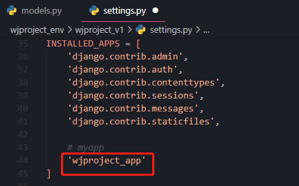


## 2. 本地配置

### 2.1 创建本地配置

- 创建自己的本地配置`local_settings.py`，可以设置自己的短信密钥，提交到git，忽略`local_settings.py`。

  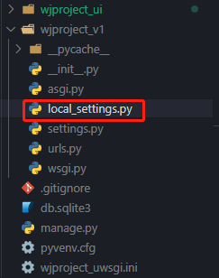

### 2.2 在`settings.py`中导入

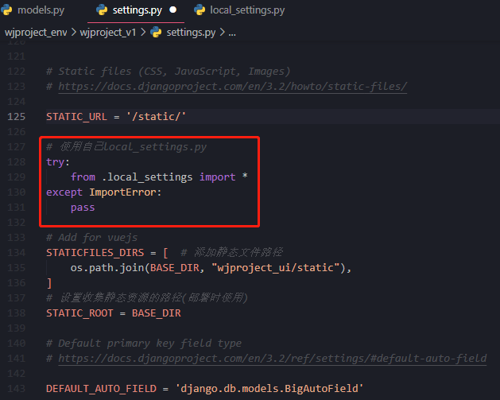

​	

    # 使用自己local_settings.py
    try:
        from .local_settings import *
    except ImportError:
        pass

### 2.3、创建自己的本地配置

```
LANGUAGE_CODE = 'zh-hans'
```

- **切记：**给别人的代码时，不给自己的`local_settings.py`


### 2.4 设置git忽略文件

- 在项目根目录创建`.gitignore`文件

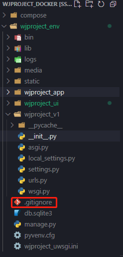

- 输入忽略的配置

```
#vscode
.vscode/

__pycache__/
*.py[cod]
*$py.class

#Django stuff:
local_settings.py
*.sqlite3
```


## 3. MongoDB第三方模块

✨**记得激活虚拟环境**

```bash
# 切换到虚拟环境目录
cd wjproject_env

# 激活虚拟环境
source bin/activate
```


### 3.1 安装`mongoengine` 

```
pip install mongoengine
```

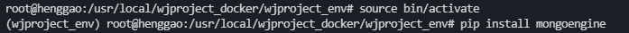


- 在`settings.py`中设置，我们已经创建了自己的`local_settings.py`，所以在`local_settings.py`中使用`mongoengine`设置mongodb数据库连接。

```python
from mongoengine import connect
# 连接mongodb中数据库名称为mongotest5的数据库
connect(alias='default', db='wjproject',
        host='127.0.0.1', port=27017)
```

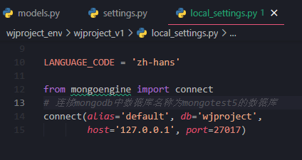

### 3.2 安装`restframework`

```bash
# 安装
pip install djangorestframework

# 使用mongoengine，安装专门的序列化模块
pip install django-rest-framework-mongoengine
```

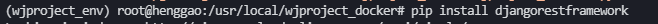

- 在`settings.py`中设置`rest_framework`和`rest_framework_mongoengine`

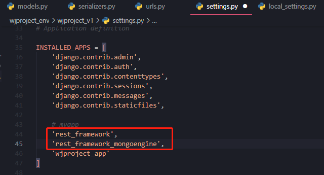


### 3.3 测试数据库

- 注意生产环境与上线的`settings.py`设置

  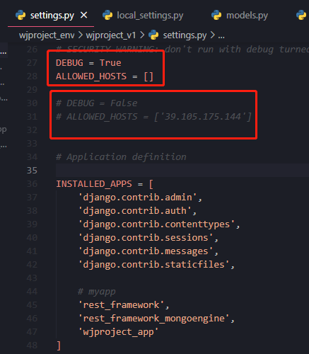

- 否则会报错

  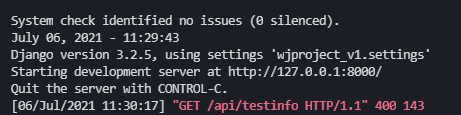

- 在`wjproject_app`项目目录中新建`serializers.py`、`urls.py`

- `models.py`

  ```python
  from django.db import models
  
  # Create your models here.
  import mongoengine
  from mongoengine.fields import DateTimeField, FileField, ImageField, IntField, StringField
  
  
  class TestModel(mongoengine.Document):
  
      name = StringField(max_length=21)
      age = IntField(default=0)
  
      meta = {'db_alias': 'default',
              'collection': 'wjproject'}
  
      def __str__(self) -> str:
          """
          docstring
          """
          return self.name
  ```

  

- `serializers.py`

  ```python
  from .models import TestModel
  from rest_framework_mongoengine.serializers import DocumentSerializer
  
  class TestSerializer(DocumentSerializer):
      class Meta:
          model = TestModel
          fields = "__all__"
  ```

  - 验证信息是否符合需求可以在这儿写

- `views.py`

  ```python
  from django.shortcuts import render
  from .models import TestModel
  from .serializers import TestSerializer
  # Create your views here.
  from rest_framework.views import APIView
  from django.http.response import HttpResponse, JsonResponse
  from rest_framework.response import Response
  
  
  class TestView(APIView):
      def get(self, request, *args, **kwargs):
          # count = TestModel.objects.filter(name="henggao").count()
          user = TestModel.objects.all()
          serializer = TestSerializer(user, many=True)
          print(serializer.data)
          print("get")
          return Response(serializer.data)
  
      def post(self, request):
          print("post")
          serializer = TestSerializer(data=request.data)
          return HttpResponse("This is post")
  ```

  

- 在根目录`wjproject_v1`的`urls.py`添加信息

  ```python
  from django.urls.conf import include
  import wjproject_app.urls
  
  urlpatterns = [
      path('api/', include(wjproject_app.urls)),
  ]
  ```

- 在`wjproject_app`的`urls.py`添加信息，没有`urls.py`则新建一个文件

  ```python
  from django.urls import path
  from django.urls.conf import include
  from . import views
  from .views import *
  from rest_framework import routers
  router = routers.DefaultRouter()
  
  urlpatterns = [
      path('', include(router.urls)),
      path('test/', TestView.as_view(),
           name='test'),  
      # path('testinfo/', views.TestInfo,
      # name="info"), 
  ]
  ```

  

- 定义好模型之后，继续按照Django模型的使用方式，生成数据库迁移，并执行迁移：

  ```
  python manage.py makemigrations wjproject_app
  python manage.py migrate
  ```

  

- 运行测试服务器

  ```
  python manage.py runserver
  ```

- 查看浏览器

  ```
  http://127.0.0.1:8000/api/test/
  ```

  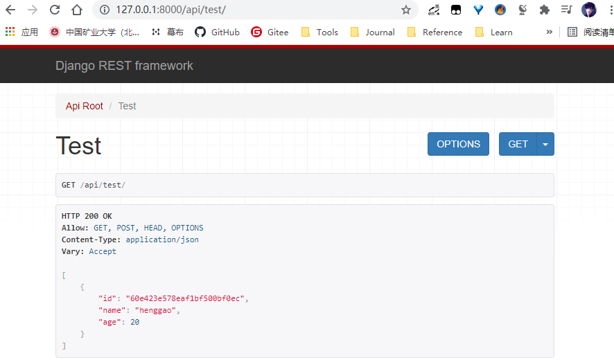