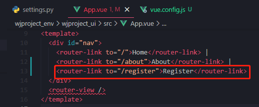
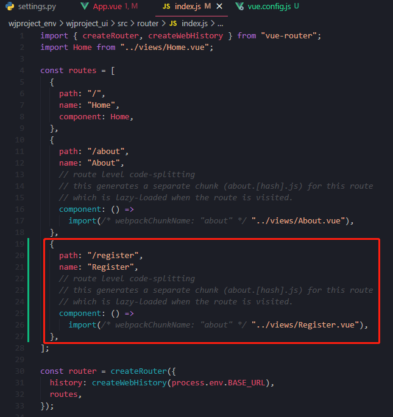
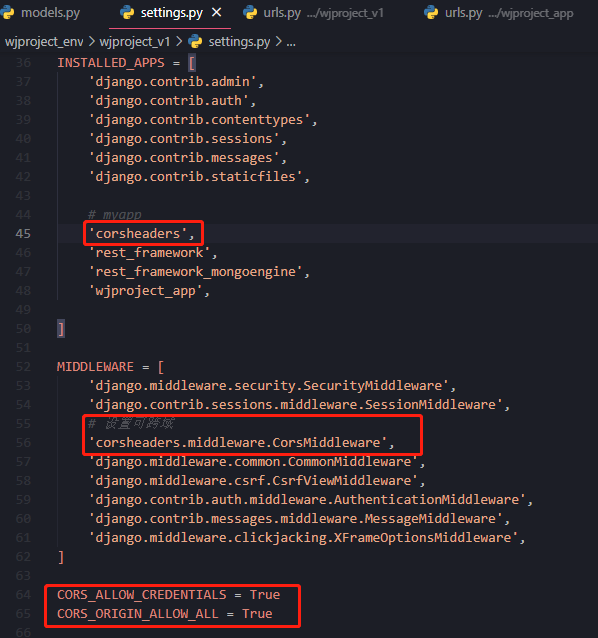

# Django整合Vue

[TOC]


## 1. 项目开发

### 1.1 前端代码

#### 准备

- 安装axios

  ```
  npm install --save axios
  ```

- main.js配置

  ```
  在main.js里配置，该两行
  import axios from 'axios'
  Vue.prototype.axios = axios   //其它组件可以使用this.axios
  ```


#### 开发

- App.vue

  

- Register.vue编写

  ```vue
  <!--
   * @Description: henggao_learning
   * @version: v1.0.0
   * @Author: henggao
   * @Date: 2021-07-06 14:32:58
   * @LastEditors: henggao
   * @LastEditTime: 2021-07-07 11:13:54
  -->
  <template>
    <div>
      <h1>Register Page</h1>
      <h2>Demo</h2>
      <p>{{ msg }}</p>
  
      <button @click="getData">获取数据</button>
    </div>
  </template>
  
  <script>
  import axios from "axios";
  export default {
    name: "Register",
    data() {
      return {
        msg:"",
      };
    },
    methods: {
      getData() {
        // const url = "http://127.0.0.1:8000/api/test/";
        const url = "/api/test/";
        axios
          .get(url, {})
          .then((response) => {
            console.log("返回数据");
            console.log(response.data);
            console.log(response.data[0]['name']);
            this.msg = response.data[0]['name']
          })
          .catch((err) => {
            console.log("error message");
          });
      },
    },
  };
  </script>
  
  <style scoped>
  </style>
  ```

- router/index.js

  
  
  

- vue.config.js,使用最上面，即可

  ```js
  /*
   * @Description: henggao_learning
   * @version: v1.0.0
   * @Author: henggao
   * @Date: 2021-07-06 20:37:20
   * @LastEditors: henggao
   * @LastEditTime: 2021-07-07 11:42:33
   */
  
  
  const path = require('path')
  module.exports = {
    publicPath: '/',
  	// 输出文件目录
    outputDir: 'dist',
    assetsDir: 'static',
    lintOnSave: false,
    chainWebpack: (config) => {
      config.resolve.symlinks(true) //热更新
    },
    configureWebpack: (config) => {
      if (process.env.NODE_ENV === 'production') {
        // 为生产环境修改配置...
        config.mode = 'production'
        // 将每个依赖包打包成单独的js文件
        let optimization = {
          runtimeChunk: 'single',
          splitChunks: {
            chunks: 'all',
            maxInitialRequests: Infinity,
            minSize: 20000,
            cacheGroups: {
              vendor: {
                test: /[\\/]node_modules[\\/]/,
                name(module) {
                  const packageName = module.context.match(/[\\/]node_modules[\\/](.*?)([\\/]|$)/)[1]
                  return `npm.${packageName.replace('@', '')}`
                }
              }
            }
          }
        }
        Object.assign(config, {
          optimization
        })
      } else {
        // 为开发环境修改配置...
        config.mode = 'development'
      }
      Object.assign(config, {
        // 开发生产共同配置
        resolve: {
          extensions: ['.js', '.vue', '.json'],//请求本地json
          alias: {
            '@': path.resolve(__dirname, './src'),
            '@c': path.resolve(__dirname, './src/components'),
            '@p': path.resolve(__dirname, './src/pages')
          } // 别名配置
        }
      })
    },
    // 生产环境是否生成 sourceMap 文件
  	productionSourceMap: true,
    css: {
  		// 是否使用css分离插件 ExtractTextPlugin
  		extract: true,
  		// 开启 CSS source maps?是否在构建样式地图，false将提高构建速度
  		sourceMap: false,
  		// css预设器配置项
  		loaderOptions: {},
  		// 启用 CSS modules for all css / pre-processor files.
  		modules: false
  	},
  	parallel: require('os').cpus().length > 1,
  	// webpack-dev-server 相关配置
  	devServer: {
  		open: true,
  		host: 'localhost',
  		port: 8080,
  		https: false,
      hotOnly: false,
      overlay: {
        warnings: false,
        errors: false
      },
  		proxy: {
        '/api': {
          // 目标 API 地址
          // target: 'http://127.0.0.1:8000/api',//这里后台的地址模拟的;应该填写你们真实的后台接口
          target: 'http://39.105.175.144:8001/api',//这里后台的地址模拟的;应该填写你们真实的后台接口
          // 如果要代理 websockets
          ws: true,
          changeOrigin: true, // 允许websockets跨域
          pathRewrite: {
            '/api': ''
          }
        }
      },
      // 代理转发配置，用于调试环境
    disableHostCheck: true,
    }
  }
  ```

- 打包前端项目，前端项目目录`whjproject_ui`下打包

  ```
  npm run build
  ```
### 1.2 后端代码

#### 准备

- 安装`django-cors-headers`，后端出于安全考虑，对于跨域有限制。

  ```
  pip install django-cors-headers
  ```
  
- 配置settings.py文件

  ```
  #app
  'corsheaders',
  
  # 设置可跨域
  'corsheaders.middleware.CorsMiddleware',
        
  CORS_ALLOW_CREDENTIALS = True
  CORS_ORIGIN_ALLOW_ALL = True
  ```

   

#### 开发

- 后端代码，（这里使用010小节进行测试）

  - models.py

  - serializers.py

  - views.py

  - urls.py

  - Django根目录`setting.py`部署上线需改设置
  
    ```
       DEBUG = False
       ALLOWED_HOSTS = ['39.105.175.144']
    ```
  
    - local_settings.py
  
  

### 1.3 启动项目

#### 1.3.1. Nginx配置信息

- 在`/etc/nginx/conf.d`文件夹下，创建`wjproject.conf`，内容如下：

  ```
  server {
     listen   8001;      
     server_name  39.105.175.144;
     charset     utf-8;
     client_max_body_size  75M;
     
     location /media {        
         expires 30d;
         autoindex  on;
         add_header Cache-Control private;
         alias /usr/local/wjproject_docker/wjproject_env/media/;
      }
      location /static {      
          expires 30d;
          autoindex on;
          add_header Cache-Control private;
          alias /usr/local/wjproject_docker/wjproject_env/wjproject_ui/dist/static;
       }
       location / {          
           include  uwsgi_params;
           uwsgi_pass 127.0.0.1:8000;
           uwsgi_read_timeout 2;
        }
  }
  
  server {
  	 listen 8004; 
  	 server_name 39.105.175.144; 
  	 location / {
  	 root /usr/local/wjproject_docker/wjproject_env/wjproject_ui/dist; 
  	 try_files $uri $uri/ /index.html; 
  	 }
   }
  ```

  - 第一个server配置信息是将`nginx`和`uWSGI`服务器实现通信连接；

    - ```
      uwsgi_pass 127.0.0.1:8000; //必须和uwsgi中socket的设置一致
      ```

  - 第二个server是配置Vue项目

  

- nginx，在任意目录下

  ```bash
  # 启动nginx
  service nginx start
  
  # 重启nginx
  service nginx reload
  
  #停止
  service nginx stop
  ```

#### 1.3.2. uWSGI配置信息

- `uWSGI`配置，在Django根目录`/wjproject_docker/wjproject_env`下新建`wjproject_uwsgi.ini`文件，输入配置信息

  ```ini
  [uwsgi]
  ; 监听的端口,不配置nginx
  ; http = :8001
  #配置端口号,指定和nginx进行套接字通信的方式：端口或文件
  socket= 127.0.0.1:8000
  ; socket= 39.105.175.144:8000
  ; socket= 0.0.0.0:8002
  #项目的绝对路径,项目所在目录，和manage.py同级
  chdir=/usr/local/wjproject_docker/wjproject_env
  
  ; 主应用中的wsgi文件
  wsgi-file = wjproject_v1/wsgi.py
  
  ; 启动一个master进程，来管理其余的子进程
  master=true
  #设置最大工作进程数
  processes=4
  threads = 2
  
  #保存主进程的pid，用来控制uwsgi服务
  pidfile=/usr/local/wjproject_docker/wjproject_env/logs/uwsgi.pid
  
  ; 设置后台运行，保存日志
  daemonize=/usr/local/wjproject_docker/wjproject_env/logs/uwsgi.log
  
  ; 设置每个工作进程处理请求的上限，达到上限时，将回收（重启）该进程。可以预防内存泄漏
  max-requests=5000
  
  #服务停止时自动移除unix Socket和pid文件
  vacuum=true
  
  # 指定依赖的虚拟环境
  ; virtualenv=/home/peter/.virtualenvs/opwfenv
  virtualenv=/usr/local/wjproject_docker/wjproject_env
  ```

  - 注意：为了配合 `nginx` 工作，端口协议是 socket , 如果换成 `http` ,则可以直接运行`uwsgi`，就能通过浏览器访问页面了。命令为 `uwsgi dj_uwsgi.ini`。

- uwsgi，在`/usr/local/wjproject_docker/wjproject_env`目录下

  ```bash
  # 启动
  uwsgi --ini wjproject_uwsgi.ini
  
  # 停止
  uwsgi --stop logs/uwsgi.pid
  pkill -f uwsgi -9
  
  #查看uwsgi端口号
  ps -ef |grep uwsgi
  ```

  

#### 1.3.3 浏览器查看

```
http://39.105.175.144:8001/
```


### 1.4 后续启动关闭

- 打包前端代码

  ```bash
  npm run build
  ```

  

- Nginx

  ```bash
  # 启动nginx
  service nginx start
  
  # 重启nginx
  service nginx reload
  
  #停止
  service nginx stop
  ```

  

- uwsgi，在`/usr/local/wjproject_docker/wjproject_env`目录下，不需要虚拟环境。

  ```bash
  # 启动
  uwsgi --ini wjproject_uwsgi.ini
  
  # 停止
  uwsgi --stop logs/uwsgi.pid
  pkill -f uwsgi -9
  
  #查看uwsgi端口号
  ps -ef |grep uwsgi
  ```

  


### 1.5 绑定域名

#### 1.5.1 域名添加配置

- 添加ip公网地址

#### 1.5.2 在服务器打开端口号

- 打开http端口号80
- 将程序部署到80端口上，或者把8080端口映射到公网的80上，或者ngnix反向代理到80端口上。
- **浏览器默认80端口不要加端口号，别的端口就要加上**。

#### 1.5.3 修改nginx配置

- 修改`/etc/nginx/conf.d`文件夹下创建的`wjproject.conf`，内容如下：

```conf
server {
   listen   80;      
   server_name  www.genghenggao.top;
   charset     utf-8;
   client_max_body_size  100M;
   
   location /media {        
       expires 30d;
       autoindex  on;
       add_header Cache-Control private;
       alias /usr/local/wjproject_docker/wjproject_env/media/;
    }
    location /static {      
        expires 30d;
        autoindex on;
        add_header Cache-Control private;
        alias /usr/local/wjproject_docker/wjproject_env/wjproject_ui/dist/static;
     }
     location / {          
         include  uwsgi_params;
         uwsgi_pass 127.0.0.1:8000;
         uwsgi_read_timeout 2;
      }
}

server {
	 listen 8004; 
	 server_name 39.105.175.144; 
	 location / {
	 root /usr/local/wjproject_docker/wjproject_env/wjproject_ui/dist; 
	 try_files $uri $uri/ /index.html; 
	 }
 }

```

- 最后版本`/etc/nginx/conf.d/wjproject.conf`

```apl
server{
    listen 80;
	server_name  genghenggao.top www.genghenggao.top;
	# server_name  39.105.175.144; 
	charset     utf-8;
	client_max_body_size  100M;
	
	location /media {        
       expires 30d;
       autoindex  on;
       add_header Cache-Control private;
       alias /usr/local/wjproject_docker/wjproject_env/media/;
    }
	
    location /static {      
        expires 30d;
        autoindex on;
        add_header Cache-Control private;
        alias /usr/local/wjproject_docker/wjproject_env/static/;
    }
	
	location / {
		root /usr/local/wjproject_docker/wjproject_env/wjproject_ui/dist;
		index  index.html;
		try_files $uri $uri/ /index.html;
	}
	location /api{
		# 配置代理路径
        proxy_pass http://127.0.0.1:8000/api;
    }
	
	location /admin{
		proxy_pass http://127.0.0.1:8000/admin;
	}
}


# Django转发请求到Nginx：127.0.0.1:8000
server {
	listen 8000;
	server_name  localhost	127.0.0.1;
	location / {
		include  /etc/nginx/uwsgi_params;
        uwsgi_pass 127.0.0.1:8002;    
	}
}


server {
	# Vue端口
	listen 8004;
	server_name  genghenggao.top www.genghenggao.top;	 
	# server_name 39.105.175.144; 
	
	location / {
		root /usr/local/wjproject_docker/wjproject_env/wjproject_ui/dist;
		index  index.html;
		try_files $uri $uri/ /index.html; 
	}
	# 配置代理路径
	location /api{
            proxy_pass http://127.0.0.1:8000/api;
    }
}

```


- 
- 
- 重启Nginx

```
http://genghenggao.top/
```


### 1.6 打包后操作

#### 1.6.1 收集静态资源

- 说明：打包好Vue，收集Django的静态资源（我是放在一个目录下的`/usr/local/wjproject_docker/wjproject_env/wjproject_ui/dist/static`）
- 虚拟环境下，运行以下命令

```
python manage.py collectstatic
```


#### 1.6.2 修改网站logo

- 修改

  - 第一种，将打包好的dist/index.html

  ```
  https://img2020.cnblogs.com/blog/1389175/202107/1389175-20210730211819913-1178460802.png
  ```

  - 第二种，修改打包前public/index.html

  ```html
   <!-- 原来 -->
      <link rel="icon" href="<%= BASE_URL %>favicon.ico">
  
   <!-- 修改为 -->
  	<link rel="icon" href="https://img2020.cnblogs.com/blog/1389175/202107/1389175-20210730211819913-1178460802.png">
  ```

  

  


### 1.7 提交git

- 配置好提交仓库

```bash
# 前端项目
cd C:\Users\Admin\Desktop\fsdownload\wjproject_docker\wjproject_env\wjproject_ui

# 后端项目目录
cd /usr/local/wjproject_docker/wjproject_env

git add .
git commit -m "commit_log"
git push
```


### 1.8 发布部署

- 进入虚拟环境，导出所有 Python 库的那个环境，然后使用那个环境下的 pip ：

```
pip freeze > requirements.txt
```

> requirement.txt 文件默认输出在桌面

然后就可以用：

```
pip install -r requirements.txt
```

来一次性安装 `requirements.txt` 里面所有的依赖包，真是非常方便。


