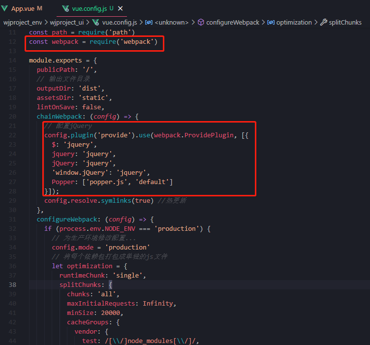

# 系统首页

[TOC]

## 1. 环境准备

### 1. 安装

- 安装`element-plus`、`bootstrap`

  ```bash
  npm install element-plus --save
  
  npm install bootstrap --save
  ```

  - bootstrap基于`jquery`，因此还需要引用2个包

- 安装`jQuery`和`Popper.js`

  ```bash
  npm install --save jquery
  
  npm install --save popper.js
  ```

- 安装`vue3-echarts`

  ```bash
  npm install --save vue3-echarts
  ```

- 进度条

  ```bash
  npm install --save nprogress
  ```

- 富文本编辑器

  ```
  npm i wangeditor --save
  ```

- 可视化

  ```
  npm install @jiaminghi/data-view
  ```

  

### 2. 引入

- `main.js`配置

  ```js
  // 引入jQuery、bootstrap
  import 'bootstrap'
   
  // 引入bootstrap样式
  import 'bootstrap/dist/css/bootstrap.min.css'
  import 'bootstrap/dist/js/bootstrap.min.js'
  
  // 新增代码：引入全部组件及样式
  import ElementPlus from 'element-plus'
  import 'element-plus/lib/theme-chalk/index.css'
  // 新增代码：注册全部组件
  app.use(ElementPlus)
  ```

- 这种方式是全局引入，采用这种引入方式，不管是否使用到的组件，都会全部加载进来，显然不是一个好的办法。

- 局部引入

  在 `main.js` 中引入并注册特定组件，在其它页面中只可使用特定组件。后续在补充

  ```
  
  ```

- `nprogress`可以在`main.js`中引用，这里也可以在`router/index.js`中引用

### 3. 配置`JQuery`

- 在 `vue.config.js` 中配置`jQuery`

  ```js
      config.plugin('provide').use(webpack.ProvidePlugin, [{
        $: 'jquery',
        jquery: 'jquery',
        jQuery: 'jquery',
        'window.jQuery': 'jquery',
        Popper: ['popper.js', 'default']
      }])
  ```

  

- 即可使用`BootStrap`


- `vue.config.js`

```js
const path = require('path')
const webpack = require('webpack')

module.exports = {
  publicPath: '/',
  // 输出文件目录
  outputDir: 'dist',
  assetsDir: 'static',
  lintOnSave: false,
  chainWebpack: (config) => {
    // 配置jQuery
    config.plugin('provide').use(webpack.ProvidePlugin, [{
      $: 'jquery',
      jquery: 'jquery',
      jQuery: 'jquery',
      'window.jQuery': 'jquery',
      Popper: ['popper.js', 'default']
    }]);
    config.resolve.symlinks(true) //热更新
  },
  configureWebpack: (config) => {
    if (process.env.NODE_ENV === 'production') {
      // 为生产环境修改配置...
      config.mode = 'production'
      // 将每个依赖包打包成单独的js文件
      let optimization = {
        runtimeChunk: 'single',
        splitChunks: {
          chunks: 'all',
          maxInitialRequests: Infinity,
          minSize: 20000,
          cacheGroups: {
            vendor: {
              test: /[\\/]node_modules[\\/]/,
              name(module) {
                const packageName = module.context.match(/[\\/]node_modules[\\/](.*?)([\\/]|$)/)[1]
                return `npm.${packageName.replace('@', '')}`
              }
            }
          }
        }
      }
      Object.assign(config, {
        optimization
      })
    } else {
      // 为开发环境修改配置...
      config.mode = 'development'
    }
    Object.assign(config, {
      // 开发生产共同配置
      resolve: {
        extensions: ['.js', '.vue', '.json'],//请求本地json
        alias: {
          '@': path.resolve(__dirname, './src'),
          '@c': path.resolve(__dirname, './src/components'),
          '@p': path.resolve(__dirname, './src/pages')
        } // 别名配置
      }
    })
    
  },
  // 生产环境是否生成 sourceMap 文件
  productionSourceMap: true,
  css: {
    // 是否使用css分离插件 ExtractTextPlugin
    extract: true,
    // 开启 CSS source maps?是否在构建样式地图，false将提高构建速度
    sourceMap: false,
    // css预设器配置项
    loaderOptions: {},
    // 启用 CSS modules for all css / pre-processor files.
    modules: false
  },
  parallel: require('os').cpus().length > 1,
  // webpack-dev-server 相关配置
  devServer: {
    open: true,
    host: 'localhost',
    port: 8080,
    https: false,
    hotOnly: false,
    overlay: {
      warnings: false,
      errors: false
    },
    proxy: {
      '/api': {
        // 目标 API 地址
        // target: 'http://127.0.0.1:8000/api',//这里后台的地址模拟的;应该填写你们真实的后台接口
        target: 'http://39.105.175.144:8001/api',//这里后台的地址模拟的;应该填写你们真实的后台接口
        // 如果要代理 websockets
        ws: true,
        changeOrigin: true, // 允许websockets跨域
        pathRewrite: {
          '/api': ''
        }
      }
    },
    // 代理转发配置，用于调试环境
    disableHostCheck: true,
  }
}
```


## 2. 系统侧边栏导航测试

### 2.1测试

- 根据 `router/index.js`信息生成导航栏

-  `router/index.js`

  ```js
  import { createRouter, createWebHistory } from "vue-router";
  import NProgress from 'nprogress'
  import 'nprogress/nprogress.css'
  import Home from "../views/Home.vue";
  import Layout from "@/views/Layout"
  
  const routes = [
     {
      path: "/",
      name: "Home",
      component: Home,
    },
    {
      path: "/about",
      name: "About",
      // route level code-splitting
      // this generates a separate chunk (about.[hash].js) for this route
      // which is lazy-loaded when the route is visited.
      component: () =>
        import(/* webpackChunkName: "about" */ "../views/About.vue"),
    },
    {
      path: "/navbar",
      name: "navbar",
      meta: { title: "用户列表", requireAuth: true },
      component: () =>
        import(/* webpackChunkName: "about" */ "@/components/NavBar.vue"),
    },
  ];
  
  const router = createRouter({
    history: createWebHistory(process.env.BASE_URL),
    routes,
  });
  
  NProgress.inc(0.2)
  NProgress.configure({ easing: 'ease', speed: 600, showSpinner: false })
  
  // 设置title
  router.beforeEach((to, from, next) => {
      // 启动进度条
      NProgress.start()
  
      // 设置头部
      if (to.meta.title) {
          document.title = to.meta.title
      } else {
          document.title = "默存"
      }
      next()
  })
  
  router.afterEach(() => {
      // 关闭进度条
      NProgress.done()
  })
  
  export default router;
  
  ```

  

- `NavBar.vue`

  ```vue
  <!--
   * @Description: henggao_learning
   * @version: v1.0.0
   * @Author: henggao
   * @Date: 2021-07-10 17:14:03
   * @LastEditors: henggao
   * @LastEditTime: 2021-07-10 20:37:43
  -->
  <template>
    <div>
      <el-radio-group v-model="isCollapse" style="margin-bottom: 20px">
        <el-radio-button :label="false">展开</el-radio-button>
        <el-radio-button :label="true">收起</el-radio-button>
      </el-radio-group>
      <el-menu
        default-active="1-4-1"
        class="el-menu-vertical-demo"
        @open="handleOpen"
        @close="handleClose"
        :collapse="isCollapse"
      >
        <el-submenu index="1">
          <template #title>
            <i class="el-icon-location"></i>
            <span>数据类型</span>
          </template>
          <el-menu-item-group>
            <el-menu-item index="1-1">报表</el-menu-item>
            <el-menu-item index="1-2">图</el-menu-item>
            <el-menu-item index="1-3">文字报告</el-menu-item>
          </el-menu-item-group>
        </el-submenu>
        <el-submenu index="2">
          <template #title>
            <i class="el-icon-location"></i>
            <span>勘探类型</span>
          </template>
          <el-menu-item-group>
            <el-menu-item index="2-1">精查</el-menu-item>
            <el-menu-item index="2-2">储量核实</el-menu-item>
            <el-menu-item index="2-3">水文</el-menu-item>
            <el-menu-item index="2-4">物探</el-menu-item>
            <el-menu-item index="2-5">其他</el-menu-item>
          </el-menu-item-group>
        </el-submenu>
        <el-menu-item index="3" disabled>
          <i class="el-icon-document"></i>
          <template #title>其他分类</template>
        </el-menu-item>
        <el-menu-item index="4">
          <i class="el-icon-setting"></i>
          <template #title>其他</template>
        </el-menu-item>
      </el-menu>
      <div>
          <p>{{routers}}</p>
          <h2>=======分割线==========</h2>
          <!-- <p>{{routers.children}}</p> -->
          <!-- <p>{{menu.children[0].name}}</p> -->
  
      </div>
       <el-container class="container">
          <el-aside :style="defaultHeight" :width="asideWidth">
              <el-affix :z-index="1200">
                  <div class="aside-logo" @click="onRefresh">
                  <el-image class="logo-image" :src="logo" fit="contain"/>
                  <span :class="[isCollapse ? 'is-collapse' : '']">
                      <span class="logo-name">乐乐购</span>
                      <span>后台管理中心</span>
                  </span>
                  </div>
              </el-affix>
              <el-menu class="aside-menu"
                       router
                       :default-active="$route.path"
                       :collapse="isCollapse"
                       background-color="#001529" text-color="#fff" active-text-color="#fff">
                  <div v-for="menu in routers" :key="menu">
                      <el-menu-item v-if="menu.children && menu.children.length === 1" :index="menu.children[0].path">
                        <i :class="menu.children[0].icon"></i>
                          <template #title>
                              {{menu.children[0].name}}
                          </template>
                      </el-menu-item>
                      <el-submenu v-else-if="menu.children" :index="menu.path">
                          <template #title>
                              <i :class="menu.icon"></i>
                              <span :class="[isCollapse ? 'is-collapse' : '']">{{menu.name}}</span>
                          </template>
                          <el-menu-item v-for="child in menu.children" :key="child" :index="child.path">
                              <i :class="child.icon"></i>
                              <template #title>
                                  {{child.name}}
                              </template>
                          </el-menu-item>
                      </el-submenu>
                  </div>
              </el-menu>
          </el-aside>
          <el-container>
              <el-header>
                  <el-row :gutter="20">
                      <el-col :span="1">
                          <div class="header-collapse" @click="onCollapse">
                              <i :class="[isCollapse ? 'el-icon-s-fold':'el-icon-s-unfold']"/>
                          </div>
                      </el-col>
                      <el-col :span="10">
                          <div class="header-breadcrumb">
                              <el-breadcrumb separator="/" v-if="this.$route.matched[0].path != '/main'">
                                  <el-breadcrumb-item :to="{ path: '/' }">工作台</el-breadcrumb-item>
                                  <el-breadcrumb-item v-for="(matched,m) in this.$route.matched" :key="m">
                                      {{matched.name}}
                                  </el-breadcrumb-item>
                              </el-breadcrumb>
                              <el-breadcrumb separator="/" v-else>
                                  <el-breadcrumb-item>工作台</el-breadcrumb-item>
                              </el-breadcrumb>
                          </div>
                      </el-col>
                      <el-col class="header-menu" :span="13">
                          <HeadMenu></HeadMenu>
                      </el-col>
                  </el-row>
              </el-header>
              <el-main :style="defaultHeight">
                  <router-view/>
              </el-main>
          </el-container>
          <el-backtop target=".el-main"></el-backtop>
      </el-container>
    </div>
  </template>
  
  <script>
  import {onBeforeMount, reactive, toRefs} from 'vue'
  import {useRouter} from 'vue-router'
  export default {
    name: "NavBar",
    Comments:{},
    setup(){
        console.log("setup");
          const router = useRouter()
          console.log(router);
              const state = reactive({
                  logo: require('@/assets/image/logo.png'),
                  isCollapse: false,
                  asideWidth: '220px',
                  defaultHeight: {
                      height: ''
                  },
                  routers: [],
              })
  
              onBeforeMount(() => {
                  state.routers = router.options.routes
                  state.defaultHeight.height = document.body.clientHeight + "px"
                  console.log(state.routers);
                  console.log(state.routers[0]);
                  console.log(state.routers[0].name);
              })
  
              const onCollapse = () => {
                  if (state.isCollapse) {
                      state.asideWidth = '220px'
                      state.isCollapse = false
                  } else {
                      state.isCollapse = true
                      state.asideWidth = '64px'
                  }
              }
  
              const onRefresh = () => {
                  router.push({ path: 'main'})
              }
  
              return {
                  ...toRefs(state),
                  onCollapse,
                  onRefresh,
              }
    },
    beforeCreate() {
      console.log("beforeCreate");
    },
    created() {
      console.log("created");
    },
    data() {
      return {
        isCollapse: true,
      };
    },
    methods: {
      handleOpen(key, keyPath) {
        console.log(key, keyPath);
      },
      handleClose(key, keyPath) {
        console.log(key, keyPath);
      },
    },
  };
  </script>
  
  <style>
  </style>
  ```
  
- 参考

  - [`Vue3`新特性，利用`@vue/composition-api`](https://blog.csdn.net/weixin_44420276/article/details/101621169)
  - [`vue-router4.x` 接受值的方法`useRoute`](https://blog.csdn.net/qq_15009739/article/details/110914983)
  - [`Vue3.0` 新特性全面探索 - 基于 `Composition Api` 快速构建实战项目](https://blog.csdn.net/jishulaozhuanjia/article/details/104748081/)


### 2.2 项目开发

#### 2.2.1 `views/Layout.vue`

```vue
<template>
  <el-container class="main-container">
    <el-aside :style="defaultHeight" :width="asideWidth">
      <el-affix :z-index="1200">
        <div class="aside-logo" @click="onRefresh">
          <el-image class="logo-image" :src="logo" fit="contain" />
          <span :class="[isCollapse ? 'is-collapse' : '']">
            <span class="logo-name">武甲</span>
            <span>图纸管理系统</span>
          </span>
        </div>
      </el-affix>
      <el-menu
        class="aside-menu"
        router
        :default-active="$route.path"
        :collapse="isCollapse"
        background-color="#001529"
        text-color="#fff"
        active-text-color="#fff"
      >
        <div v-for="menu in routers" :key="menu">
          <el-menu-item
            v-if="menu.children && menu.children.length === 1"
            :index="menu.children[0].path"
          >
            <i :class="menu.children[0].icon"></i>
            <template #title>
              {{ menu.children[0].name }}
            </template>
          </el-menu-item>
          <el-submenu v-else-if="menu.children" :index="menu.path">
            <template #title>
              <i :class="menu.icon"></i>
              <span :class="[isCollapse ? 'is-collapse' : '']">{{
                menu.name
              }}</span>
            </template>
            <el-menu-item
              v-for="child in menu.children"
              :key="child"
              :index="child.path"
            >
              <i :class="child.icon"></i>
              <template #title>
                {{ child.name }}
              </template>
            </el-menu-item>
          </el-submenu>
        </div>
      </el-menu>
    </el-aside>
    <el-container>
      <el-header>
        <el-row :gutter="20">
          <el-col :span="1">
            <div class="header-collapse" @click="onCollapse">
              <i
                :class="[isCollapse ? 'el-icon-s-fold' : 'el-icon-s-unfold']"
              />
            </div>
          </el-col>
          <el-col :span="10">
            <div class="header-breadcrumb">
              <el-breadcrumb
                separator="/"
                v-if="this.$route.matched[0].path != '/main'"
              >
                <el-breadcrumb-item :to="{ path: '/' }"
                  >工作台</el-breadcrumb-item
                >
                <el-breadcrumb-item
                  v-for="(matched, m) in this.$route.matched"
                  :key="m"
                >
                  {{ matched.name }}
                </el-breadcrumb-item>
              </el-breadcrumb>
              <el-breadcrumb separator="/" v-else>
                <el-breadcrumb-item>工作台</el-breadcrumb-item>
              </el-breadcrumb>
            </div>
          </el-col>
          <el-col class="header-menu" :span="13">
            <HeadMenu></HeadMenu>
          </el-col>
        </el-row>
      </el-header>
      <el-main :style="defaultHeight">
        <router-view />
      </el-main>
    </el-container>
    <el-backtop target=".el-main"></el-backtop>
  </el-container>
</template>
<script>
import { onBeforeMount, reactive, toRefs } from "vue";
import { useRouter } from "vue-router";
import HeadMenu from "@/components/HeadMenu";

export default {
  components: {
    HeadMenu,
  },
  setup() {
    const router = useRouter();
    const state = reactive({
      logo: require("@/assets/image/logo.png"),
      isCollapse: false,
      asideWidth: "220px",
      defaultHeight: {
        height: "",
      },
      routers: [],
    });

    onBeforeMount(() => {
      state.routers = router.options.routes;
      state.defaultHeight.height = document.body.clientHeight + "px";
      console.log(state.routers);
    });

    const onCollapse = () => {
      if (state.isCollapse) {
        state.asideWidth = "220px";
        state.isCollapse = false;
      } else {
        state.isCollapse = true;
        state.asideWidth = "64px";
      }
    };

    const onRefresh = () => {
      router.push({ path: "main" });
    };

    return {
      ...toRefs(state),
      onCollapse,
      onRefresh,
    };
  },
};
</script>

<style  lang="scss">
.main-container {
  background: #f5f7f9;
  // width: 100vw;
  // height: 100%;
  // width: 100%;

  .el-aside {
    height: 100%;
    transition: all 0.5s;
    background-color: #001529;
    overflow-y: auto;
    overflow-x: hidden;

    .aside-logo {
      height: 59px;
      color: white;
      cursor: pointer;
      border-bottom: 1px #cccccc solid;

      .logo-image {
        width: 40px;
        height: 40px;
        top: 12px;
        padding-left: 12px;
      }

      .logo-name {
        font-size: 20px;
        font-weight: bold;
        padding: 2px;
      }
    }

    .aside-menu:not(.el-menu--collapse) {
      width: 220px;

      .el-menu-item.is-active {
        background-color: #d9393b !important;
      }
    }

    .is-collapse {
      display: none;
    }

    &::-webkit-scrollbar {
      width: 0px;
    }
  }

  .el-header {
    background: white;
    line-height: 60px;
    font-size: 24px;
    border-bottom: 1px #cccccc solid;

    .header-collapse {
      cursor: pointer;
    }

    .header-breadcrumb {
      padding-top: 0.9em;
    }

    .header-menu {
      text-align: right;
    }
  }

  .el-main {
    padding: 0.6em;
    overflow-x: hidden;
    overflow-y: auto;

    &::-webkit-scrollbar {
      width: 0px;
    }
  }
}
</style>
```


#### 2.2.2 `views/Home.vue`

```vue
<template>
  <div class="home">
    <div class="home-title">
      <el-card shadow="always">
        <div class="title-msg">工作台</div>
        <el-row>
          <el-col :span="1" :offset="1">
            <el-avatar :size="60" :src="avatar"></el-avatar>
          </el-col>
          <el-col :span="5">
            <div class="greetings">早上好,admin,祝你新的一天工作愉快</div>
            <div class="weather">今天小雨转阴天,21~27°,天凉,注意加衣</div>
          </el-col>
          <el-col :span="6" :offset="10">
            <el-row>
              <el-col class="item" :span="8">
                <i class="el-icon-info p4em c-brown" />
                <span>代办事项</span>
              </el-col>
              <el-col class="item" :span="8">
                <i class="el-icon-postcard p4em c-coral" />
                <span>代办事项</span>
              </el-col>
              <el-col class="item" :span="8">
                <i class="el-icon-edit-outline p4em" />
                <span>代办事项</span>
              </el-col>
            </el-row>
            <el-row>
              <el-col class="item item-text" :span="8">8/10</el-col>
              <el-col class="item item-text" :span="8">1/20</el-col>
              <el-col class="item item-text" :span="8">5/6</el-col>
            </el-row>
          </el-col>
        </el-row>
      </el-card>
    </div>
    <div class="home-card m120">
      <el-row :gutter="20">
        <el-col :span="6" v-for="(card, c) in cards" :key="c">
          <el-card shadow="always">
            <el-row>
              <el-col :span="4">
                <el-image
                  style="width: 60px; height: 60px"
                  v-if="c == 0"
                  :src="require('@/assets/image/icon/kpi.png')"
                />
                <el-image
                  style="width: 60px; height: 60px"
                  v-else-if="c == 1"
                  :src="require('@/assets/image/icon/zc.png')"
                />
                <el-image
                  style="width: 60px; height: 60px"
                  v-else-if="c == 2"
                  :src="require('@/assets/image/icon/zzl.png')"
                />
                <el-image
                  style="width: 60px; height: 60px"
                  v-else-if="c == 3"
                  :src="require('@/assets/image/icon/htl.png')"
                />
              </el-col>
              <el-col :span="16" :offset="1">
                <div>
                  <div class="num-effect">￥{{ card.price }}</div>
                  <div class="card-text">
                    <span>{{ card.ratio }}%</span>
                    <i class="el-icon-top-right c-forestgreen" />
                    <span>{{ card.type }}</span>
                  </div>
                </div>
              </el-col>
            </el-row>
          </el-card>
        </el-col>
      </el-row>
    </div>
    <div class="home-chart m120">
      <el-row :gutter="20">
        <!-- 左边内容   -->
        <el-col :span="18">
          <el-card shadow="always">
            <template #header>
              <el-image
                class="icon"
                :src="require('@/assets/image/icon/histogram.png')"
              />
              <span class="f-weight">数据汇总</span>
              <div class="div-right">
                <el-button type="text">去年</el-button>
                <el-button class="p4em" type="text">今年</el-button>
                <el-date-picker
                  v-model="date"
                  type="daterange"
                  size="mini"
                  range-separator="至"
                  start-placeholder="开始日期"
                  end-placeholder="结束日期"
                />
              </div>
            </template>
            <vue-echarts :option="overviewOption" style="height: 400px" />
          </el-card>
          <el-card class="m120" shadow="always">
            <template #header>
              <el-image
                class="icon"
                :src="require('@/assets/image/icon/list.png')"
              />
              <span class="f-weight">数据统计</span>
            </template>
            <el-row :gutter="20">
              <el-col :span="6" v-for="(sale, s) in sales" :key="s">
                <div
                  class="sale-item"
                  :style="{ border: '1px ' + sale.color + ' solid' }"
                >
                  <div>{{ sale.title }}</div>
                  <el-row :style="{ background: sale.color }">
                    <el-col :span="2" :offset="2">
                      <el-image
                        class="icon item-image"
                        :src="sale.iconType > 0 ? money : deal"
                      />
                    </el-col>
                    <el-col class="item-num" :span="10" :offset="10">
                      <span>{{ sale.num }}</span>
                    </el-col>
                  </el-row>
                </div>
              </el-col>
            </el-row>
          </el-card>
        </el-col>
        <!-- 右边内容   -->
        <el-col :span="6">
          <el-card shadow="always">
            <template #header>
              <el-image
                class="icon"
                :src="require('@/assets/image/icon/pie.png')"
              />
              <span class="f-weight">总用户率</span>
            </template>
            <vue-echarts :option="payTypeOPtion" style="height: 200px" />
          </el-card>
          <el-card class="m120" shadow="always">
            <template #header>
              <el-image
                class="icon"
                :src="require('@/assets/image/icon/satisfaction.png')"
              />
              <span class="f-weight">客户满意度</span>
            </template>
            <div v-for="(satisfaction, s) in satisfactions" :key="s">
              <el-row class="satisfaction" :gutter="20">
                <el-col :span="8">
                  <span class="satisfaction-number">{{
                    satisfaction.num
                  }}</span>
                </el-col>
                <el-col :span="8">
                  <el-image
                    class="satisfaction-image"
                    :src="satisfaction.image"
                  />
                  <div class="satisfaction-msg">{{ satisfaction.message }}</div>
                </el-col>
                <el-col :span="8">
                  <span class="satisfaction-ratio"
                    >{{ satisfaction.ratio }}%</span
                  >
                </el-col>
              </el-row>
              <el-divider v-if="satisfactions.length - 1 != s"></el-divider>
            </div>
          </el-card>
        </el-col>
      </el-row>
    </div>
  </div>
</template>

<script>
import { onMounted, reactive, toRefs } from "vue";
import { VueEcharts } from "vue3-echarts";
// import {revenueAnalysis,overview} from '@/api/serviceApi'

export default {
  setup() {
    const state = reactive({
      avatar: require("@/assets/image/logo.png"),
      deal: require("@/assets/image/icon/成交.png"),
      money: require("@/assets/image/icon/人民币.png"),
      cards: [],
      overviewOption: {},
      date: "",
      payTypeOPtion: {},
      satisfactions: [],
      sales: [],
    });

    onMounted(() => {
      // 请求接口
      // revenueAnalysis().then(res => {
      //     if(res.code === 200){
      //         state.cards = res.data
      //     }
      // })

      state.cards = [
        {
          icon: require("@/assets/image/icon/kpi.png"),
          price: "15000",
          ratio: "87",
          type: "总上传数据量",
        },
        {
          icon: require("@/assets/image/icon/zc.png"),
          price: "15000",
          ratio: "87",
          type: "总下载数据量",
        },
        {
          icon: require("@/assets/image/icon/zzl.png"),
          price: "15000",
          ratio: "87",
          type: "总审核数据量",
        },
        {
          icon: require("@/assets/image/icon/htl.png"),
          price: "15000",
          ratio: "87",
          type: "总用户访问量",
        },
      ];

      // 总览
      state.overviewOption = {
        legend: {},
        tooltip: {},
        dataset: {
          dimensions: ["product", "上传数据量", "下载数据量", "审核数据量"],
          source: [
            ["1月", 43.3, 85.8, 93.7],
            ["2月", 83.1, 73.4, 55.1],
            ["3月", 86.4, 65.2, 82.5],
            ["4月", 72.4, 53.9, 39.1],
            ["5月", 72.4, 53.9, 39.1],
            ["6月", 72.4, 53.9, 39.1],
            ["7月", 72.4, 53.9, 39.1],
            ["8月", 72.4, 53.9, 39.1],
            ["9月", 72.4, 53.9, 39.1],
            ["10月", 72.4, 53.9, 39.1],
            ["11月", 72.4, 53.9, 39.1],
            ["12月", 72.4, 53.9, 39.1],
          ],
        },
        color: ["#20c997", "#007bff", "#dc3545"],
        xAxis: {
          type: "category",
          axisTick: {
            show: false, // 不显示坐标轴刻度线
          },
        },
        yAxis: {
          show: true, // 不显示坐标轴线、坐标轴刻度线和坐标轴上的文字
          axisTick: {
            show: false, // 不显示坐标轴刻度线
          },
          axisLine: {
            show: false, // 不显示坐标轴线
          },
          splitLine: {
            show: true, // 不显示网格线
          },
        },
        series: [{ type: "bar" }, { type: "bar" }, { type: "bar" }],
      };

      // 用户分布
      state.payTypeOPtion = {
        title: {},
        tooltip: {
          trigger: "item",
          formatter: "{a} <br/>{b} : {c}人 ({d}%)",
        },
        color: ["#dc3545", "#007bff", "#28a745"],
        series: [
          {
            name: "用户部门",
            type: "pie",
            radius: "90%",
            avoidLabelOverlap: false,
            roseType: "radius",
            center: ["50%", "50%"],
            itemStyle: {
              borderRadius: 10,
              borderColor: "#fff",
              borderWidth: 2,
            },
            label: {
              show: true,
              position: "inner",
            },
            labelLine: {
              show: false,
            },
            data: [
              { value: 335, name: "安保处" },
              { value: 310, name: "人事部" },
              { value: 274, name: "后勤部" },
            ].sort(function (a, b) {
              return a.value - b.value;
            }),
          },
        ],
      };

      // 客户满意度
      state.satisfactions = [
        {
          num: "20142",
          image: require("@/assets/image/icon/开心.png"),
          message: "满意",
          ratio: "60",
        },
        {
          num: "12455",
          image: require("@/assets/image/icon/笑脸.png"),
          message: "比较满意",
          ratio: "36",
        },
        {
          num: "12",
          image: require("@/assets/image/icon/难过.png"),
          message: "一般",
          ratio: "4",
        },
      ];

      // 销售数据统计
      state.sales = [
        { title: "今日上传数据量", color: "#FFA333", num: "10", iconType: "0" },
        { title: "昨日上传数据量", color: "#A155E8", num: "52", iconType: "0" },
        { title: "本月上传数据量", color: "#6D91FF", num: "125", iconType: "0" },
        {
          title: "累计上传数据量(年)",
          color: "#A233A2",
          num: "12547",
          iconType: "0",
        },
        { title: "今日下载数据量", color: "#AED75B", num: "965", iconType: "1" },
        { title: "昨日下载数据量", color: "#A27B33", num: "852", iconType: "1" },
        { title: "本月下载数据量", color: "#8D8DD1", num: "1254", iconType: "1" },
        {
          title: "累计下载数据量(年)",
          color: "#C14E4E",
          num: "123685",
          iconType: "1",
        },
      ];
    });

    return {
      ...toRefs(state),
    };
  },

  components: {
    VueEcharts,
  },
};
</script>
<style lang="scss">
@import "../assets/css/common.css";

.home {
  padding-bottom: 4em;

  .home-title {
    .title-msg {
      font-size: 20px;
      padding-bottom: 2rem;
    }

    .greetings {
      font-size: 18px;
      line-height: 30px;
      letter-spacing: 0.1em;
    }

    .weather {
      font-size: 14px;
      color: #999;
      line-height: 24px;
      letter-spacing: 0.1em;
    }

    .item {
      color: #808695;
      text-align: center;
      padding: 0.5em;
    }

    .item-text {
      font-weight: 700;
      font-size: 20px;
      color: #000000;
    }
  }

  .home-card .card-text {
    font-size: 12px;
    font-weight: 400;
    color: #494b52;
    letter-spacing: 0.1em;
    padding-top: 0.4em;
  }

  .home-chart {
    .satisfaction {
      padding-top: 0.2em;
      text-align: center;
    }

    .satisfaction-number {
      font-weight: 700;
      font-size: 30px;
      color: #515a6e;
      line-height: 120px;
      text-align: center;
    }

    .satisfaction-image {
      width: 60px;
      height: 60px;
      text-align: center;
    }

    .satisfaction-msg {
      line-height: 35px;
      color: #808695;
      font-size: 14px;
      text-align: center;
    }

    .satisfaction-ratio {
      line-height: 120px;
      color: #36c17b;
      font-size: 18px;
      text-align: center;
    }

    .sale-item {
      border-radius: 0.2em;
      line-height: 3.2em;
      text-align: center;
      margin: 1em 0;

      .item-image {
        top: 0.6em;
      }

      .item-num {
        height: 2.4em;
        line-height: 2.4em;
        color: white;
        font-weight: bold;
        font-size: 20px;
        text-align: right;
        padding-right: 1em;
      }
    }
  }
}
</style>


```


#### 2.2.3 `viwes/App.vue`

```vue
<!--
 * @Description: henggao_learning
 * @version: v1.0.0
 * @Author: henggao
 * @Date: 2021-07-10 16:55:38
 * @LastEditors: henggao
 * @LastEditTime: 2021-07-10 23:46:35
-->
<template>
  <!-- <div id="nav">
    <router-link to="/">Home</router-link> |
    <router-link to="/about">About</router-link>
  </div> -->
  <router-view />
</template>

<style lang="scss">
// #app {
//   font-family: Avenir, Helvetica, Arial, sans-serif;
//   -webkit-font-smoothing: antialiased;
//   -moz-osx-font-smoothing: grayscale;
//   text-align: center;
//   color: #2c3e50;
// }

// #nav {
//   padding: 30px;

//   a {
//     font-weight: bold;
//     color: #2c3e50;

//     &.router-link-exact-active {
//       color: #42b983;
//     }
//   }
// }
html,
body {
  width: 100%;
  height: 100%;
  padding: 0;
  margin: 0;
  overflow: hidden;
  font-family: Avenir, Helvetica, Arial, sans-serif;
}
#nprogress .bar {
  /*自定义进度条颜色*/
  background: #d9393b !important;
}
</style>

```


#### 2.2.4 `router/index.js`

```js
/*
 * @Description: henggao_learning
 * @version: v1.0.0
 * @Author: henggao
 * @Date: 2021-07-10 16:55:38
 * @LastEditors: henggao
 * @LastEditTime: 2021-07-10 23:30:09
 */
import { createRouter, createWebHistory } from "vue-router";
import NProgress from 'nprogress'
import 'nprogress/nprogress.css'
import Home from "../views/Home.vue";
import Layout from "@/views/Layout"

const routes = [
  {
    path: '/',
    redirect: '/main'
},
  // {
  //   path: "/",
  //   name: "Home",
  //   component: Home,
  // },
  // {
  //   path: "/about",
  //   name: "About",
  //   // route level code-splitting
  //   // this generates a separate chunk (about.[hash].js) for this route
  //   // which is lazy-loaded when the route is visited.
  //   component: () =>
  //     import(/* webpackChunkName: "about" */ "../views/About.vue"),
  // },
  // {
  //   path: "/navbar",
  //   name: "navbar",
  //   meta: { title: "用户列表", requireAuth: true },
  //   component: () =>
  //     import(/* webpackChunkName: "about" */ "@/components/NavBar.vue"),
  // },
  {
    path: '/main',
    component: Layout,
    icon: "el-icon-s-home",
    meta: { title: "工作台", requireAuth: true },
    // redirect: '/home',
    redirect: '/home',
    children: [
      {
        path: "/home",
        name: "工作台",
        icon: "el-icon-s-home",
        meta: { title: "工作台", requireAuth: true },
        component: () => import('@/views/Home.vue')
      }
    ]
  },
  {
    path: "/datatype",
    name: "数据类型",
    component: Layout,
    icon: "el-icon-s-shop",
    meta: { title: "数据类型", requireAuth: true },
    children: [
      {
        path: "/data-list",
        name: "报表",
        icon: "el-icon-s-data",
        meta: { title: "报表", requireAuth: true },
        component: () => import("@/views/About.vue")
      },
      {
        path: "/picture",
        name: "图",
        icon: "el-icon-document-add",
        meta: { title: "图", requireAuth: true },
        component: () => import("@/components/HelloWorld.vue")
      },
      {
        path: "/word",
        name: "文字报告",
        icon: "el-icon-document-add",
        meta: { title: "文字报告", requireAuth: true },
        component: () => import("@/components/HelloWorld.vue")
      }
    ]
  },
  {
    path: "/worktype",
    name: "勘探工作类型",
    component: Layout,
    icon: "el-icon-s-shop",
    meta: { title: "勘探工作类型", requireAuth: true },
    children: [
      {
        path: "/accurate",
        name: "精查",
        icon: "el-icon-s-data",
        meta: { title: "精查", requireAuth: true },
        component: () => import("@/views/About.vue")
      },
      {
        path: "/reserve-verify",
        name: "储量核实",
        icon: "el-icon-document-add",
        meta: { title: "储量核实", requireAuth: true },
        component: () => import("@/components/HelloWorld.vue")
      },
      {
        path: "/hydrology",
        name: "水文",
        icon: "el-icon-document-add",
        meta: { title: "水文", requireAuth: true },
        component: () => import("@/components/HelloWorld.vue")
      },
      {
        path: "/geophy-prospect",
        name: "物探",
        icon: "el-icon-document-add",
        meta: { title: "物探", requireAuth: true },
        component: () => import("@/components/HelloWorld.vue")
      },
      {
        path: "/others",
        name: "其他",
        icon: "el-icon-document-add",
        meta: { title: "其他", requireAuth: true },
        component: () => import("@/components/HelloWorld.vue")
      },
    ]
  },
];

const router = createRouter({
  history: createWebHistory(process.env.BASE_URL),
  routes,
});

NProgress.inc(0.2)
NProgress.configure({ easing: 'ease', speed: 600, showSpinner: false })

// 设置title
router.beforeEach((to, from, next) => {
    // 启动进度条
    NProgress.start()

    // 设置头部
    if (to.meta.title) {
        document.title = to.meta.title
    } else {
        document.title = "默存"
    }
    next()
})

router.afterEach(() => {
    // 关闭进度条
    NProgress.done()
})

export default router;

```


#### 2.2.5 `main.js`

```js
import { createApp } from "vue";
import App from "./App.vue";
import router from "./router";
import store from "./store";
// 引入jQuery、bootstrap
import 'bootstrap'
 
// 引入bootstrap样式
import 'bootstrap/dist/css/bootstrap.min.css'
import 'bootstrap/dist/js/bootstrap.min.js'

// 新增代码：引入全部组件及样式
import ElementPlus from 'element-plus'
import 'element-plus/lib/theme-chalk/index.css'
// 新增代码：注册全部组件

createApp(App).use(store).use(router).use(ElementPlus).mount("#app");

```


- 参考：https://typ1805.github.io/mall-vue3-manage/#/home