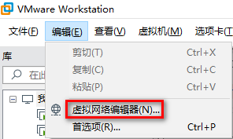
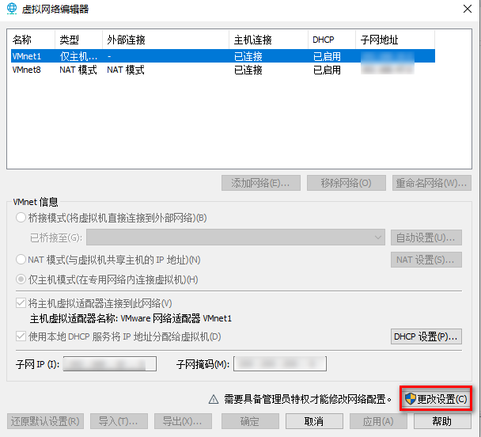
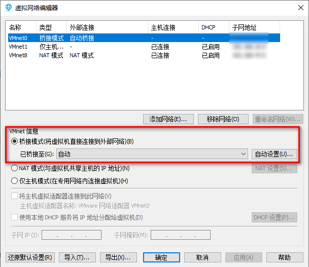
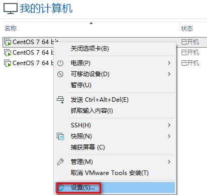
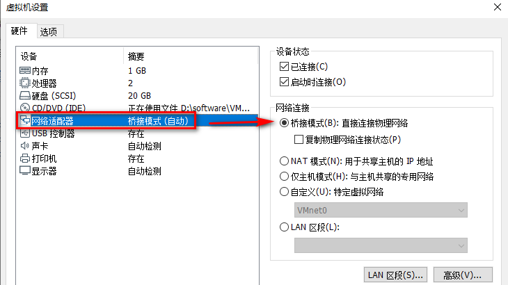
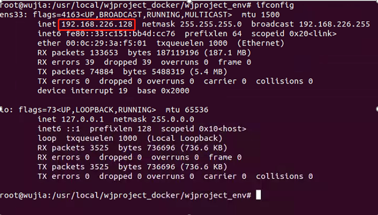

# 接入内网操作

[TOC]

##  1. 配置VMware

**一、首先配置VMware的 “虚拟网络设置”。**



 

 **二、“更改设置”**



**三、vm信息设置为“桥接模式”**




 **四、设置vmware安装系统的网络模式**




**五、网络适配器-->网络链接 设置为 “桥接模式”**




 **六、验证一下**

6.1 在Ubuntu20.04上 ping www.baidu.com 看是否通

```
ping www.baidu.com 
```

我配置的过程很顺，如果不成功，看看Ubuntu20.04的防火墙是否对22端口限制。


## 2. 修改文件

**2.1 查看配置好的Ubuntu20.04的ip**

```
ifconfig
```



- 记住IP地址

  

**2.2 修改settings.py**

- 进入目录

  ```bash
  # 1、root权限
  sudo su root
  
  # 2、切换目录
  cd /usr/local/wjproject_docker/wjproject_env/
  ```

  

- 修改settings.py，终端执行命令

  ```
  vim wjproject_v1/settings.py
  ```

  - 进入后按一下i，出现如图所示界面，修改如下内容

  ```python
  ......
  # 打开端口号
  # DEBUG = True
  # ALLOWED_HOSTS = ['*', ] 	# 允许所有的IP可以访问
  DEBUG = False
  ALLOWED_HOSTS = ['127.0.0.1', '192.168.226.128']
  ......
  ```


- 修改local_settings.py，终端执行命令

  ```
  vim wjproject_v1/local_settings.py
  ```

  - 修改如下内容
  
  ```python
  ......
  # 修改首页设置, 指向新创建的控制面板
  # 设置右上角Home图标跳转链接，会以另外一个窗口打开
  SIMPLEUI_INDEX = 'http://192.168.226.128:80/'
  ......
  ```
  
  

**2.3 配置nginx**

- /etc/nginx/conf.d/wjproject.conf

  ```bash
  cd /etc/nginx/conf.d
  vim wjproject.conf
  ```

- 修改第一个server_name的ip，地址为上面查询到的新的IP

  - server_name 192.168.226.128
  
  ```
  server{
      listen 80;
      server_name 192.168.226.128
      .......
  ```
  
  

**2.4 重启项目**

```bash
# 1、root权限
sudo su root
# 2、切换目录
cd /usr/local/wjproject_docker/wjproject_env/
# 3、删除文件
rm -rf logs/uwsgi.pid
#4、启动uwsgi
uwsgi --ini wjproject_uwsgi.ini
# 5、重启nginx
service nginx reload
```


**遇到登录页面视频没有加载问题**

```bash
# 1、root权限
sudo su root

# 2、切换目录
cd /usr/local/wjproject_docker/wjproject_env/

# 3、收集静态文件
python manage.py collectstatic

# 4、重启nginx
service nginx reload
```

