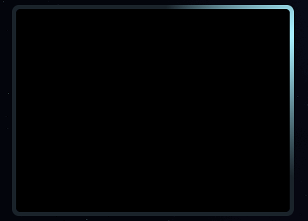
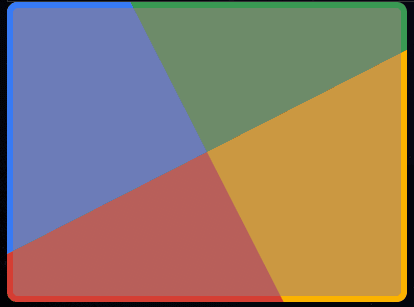
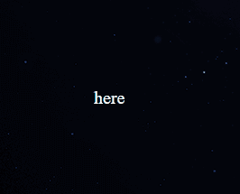
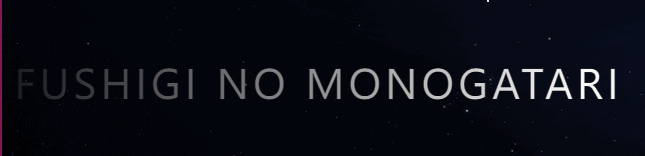

#  `CSS`设置边框

[TOC]

## 样式一

- 效果预览



- 代码

```html
<div class="conic"></div>

//css
.conic {
  position: relative;
  z-index: 0;
  width: 400px;
  height: 300px;
  margin: 20px;
  border-radius: 10px;
  overflow: hidden;
  padding: 2rem;

  &::before {
    content: "";
    position: absolute;
    z-index: -2;
    left: -50%;
    top: -50%;
    width: 200%;
    height: 200%;
    background-color: #1a232a;
    background-repeat: no-repeat;
    background-position: 0 0;
    background-image: conic-gradient(
      transparent,
      rgba(168, 239, 255, 1),
      transparent 30%
    );
    animation: rotate 4s linear infinite;
  }

  &::after {
    content: "";
    position: absolute;
    z-index: -1;
    left: 6px;
    top: 6px;
    width: calc(100% - 12px);
    height: calc(100% - 12px);
    background: #000;
    border-radius: 5px;
  }
}
```


## 样式二

- 效果预览


- 代码

```
<div class="hello">Hello</div>

//scss
.hello {
  position: relative;
  margin: auto;
  width: 120px;
  line-height: 64px;
  text-align: center;
  color: #fff;
  font-size: 20px;
  border: 2px solid gold;
  border-radius: 10px;
  background: gold;
  transition: all 0.3s;
  cursor: pointer;

  &:hover {
    filter: contrast(1.1);
  }

  &:active {
    filter: contrast(0.9);
  }

  &::before,
  &::after {
    content: "";
    position: absolute;
    top: -10px;
    left: -10px;
    right: -10px;
    bottom: -10px;
    border: 2px solid gold;
    transition: all 0.5s;
    animation: clippath 3s infinite linear;
    border-radius: 10px;
  }

  &::after {
    animation: clippath 3s infinite -1.5s linear;
  }
}

@keyframes clippath {
  0%,
  100% {
    clip-path: inset(0 0 98% 0);
  }

  25% {
    clip-path: inset(0 98% 0 0);
  }
  50% {
    clip-path: inset(98% 0 0 0);
  }
  75% {
    clip-path: inset(0 0 0 98%);
  }
}

.bg::before {
  background: rgba(255, 215, 0, 0.5);
}
```


## 样式三

- 效果预览

  

  

- 代码

  ```
  <div class="border-image-clip-path"></div>
  
  //css
  .border-image-clip-path {
    width: 200px;
    height: 100px;
    margin: auto;
    border: 10px solid;
    border-image: linear-gradient(45deg, gold, deeppink) 1;
    clip-path: inset(0px round 10px);
    animation: huerotate 6s infinite linear;
    filter: hue-rotate(360deg);
  }
  
  @keyframes huerotate {
    0% {
      filter: hue-rotate(0deg);
    }
    100% {
      filter: hue-rorate(360deg);
    }
  }
  ```

  

## 样式四

- 效果预览

  


- 代码

  ```
   <div class="rainbow"></div>
  
  //css
  .rainbow {
    position: relative;
    z-index: 0;
    width: 400px;
    height: 300px;
    border-radius: 10px;
    overflow: hidden;
    padding: 2rem;
  
    &::before {
      content: "";
      position: absolute;
      z-index: -2;
      left: -50%;
      top: -50%;
      width: 200%;
      height: 200%;
      background-color: #399953;
      background-repeat: no-repeat;
      background-size: 50% 50%, 50% 50%;
      background-position: 0 0, 100% 0, 100% 100%, 0 100%;
      background-image: linear-gradient(#399953, #399953),
        linear-gradient(#fbb300, #fbb300), linear-gradient(#d53e33, #d53e33),
        linear-gradient(#377af5, #377af5);
      animation: rotate 4s linear infinite;
    }
  
    &::after {
      content: "";
      position: absolute;
      z-index: -1;
      left: 6px;
      top: 6px;
      width: calc(100% - 12px);
      height: calc(100% - 12px);
      background: rgb(158, 127, 127);
      border-radius: 5px;
      animation: opacityChange 3s infinite alternate;
    }
  }
  
  @keyframes opacityChange {
    50% {
      opacity: 1;
    }
    100% {
      opacity: 0.5;
    }
  }
  ```

  


## 样式五

- 效果预览

  



- 代码

  ```
  <div class="transBorder">here</div>
  
  //css
  .transBorder {
    margin: 10px 15px;
    cursor: pointer;
    display: block;
    width: 200px;
    height: 200px;
    text-align: center;
    line-height: 200px;
    transition: ease-in 0.4s;
    background: linear-gradient(0, #108b96 2px, #009606 2px) no-repeat,
      linear-gradient(-90deg, #96645f 2px, #961478 2px) no-repeat,
      linear-gradient(-180deg, #869660 2px, #544996 2px) no-repeat,
      linear-gradient(-270deg, #439638 2px, #308e96 2px) no-repeat;
    background-size: 0 2px, 2px 0, 0 2px, 2px 0;
    background-position: left top, right top, right bottom, left bottom;
  }
  .transBorder:hover {
    border-radius: 20%;
    background-size: 100% 5px, 5px 100%, 100% 5px, 5px 100%;
  }
  ```

  

## 样式六：文字动态显示

- 效果浏览

  

- 代码

```
<p class="shining">fushigi no monogatari</p>

//css
.shining {
  font-size: 2em;
  font-family: Lato, sans-serif;
  letter-spacing: 4px;
  text-transform: uppercase;
  background: linear-gradient(
    90deg,
    rgba(0, 0, 0, 1) 0%,
    rgba(255, 255, 255, 1) 50%,
    rgba(0, 0, 0, 1) 100%
  );
  background-size: 80%;
  background-repeat: no-repeat;
  // below two lines create text gradient effect
  color: transparent;
  background-clip: text;
  animation: shining 3s linear infinite;
}

@keyframes shining {
  from {
    background-position: -500%;
  }
  to {
    background-position: 500%;
  }
}

```


- [ref](https://www.cnblogs.com/coco1s/p/14291567.html)
- [ref](https://juejin.cn/post/6844904031513477128)